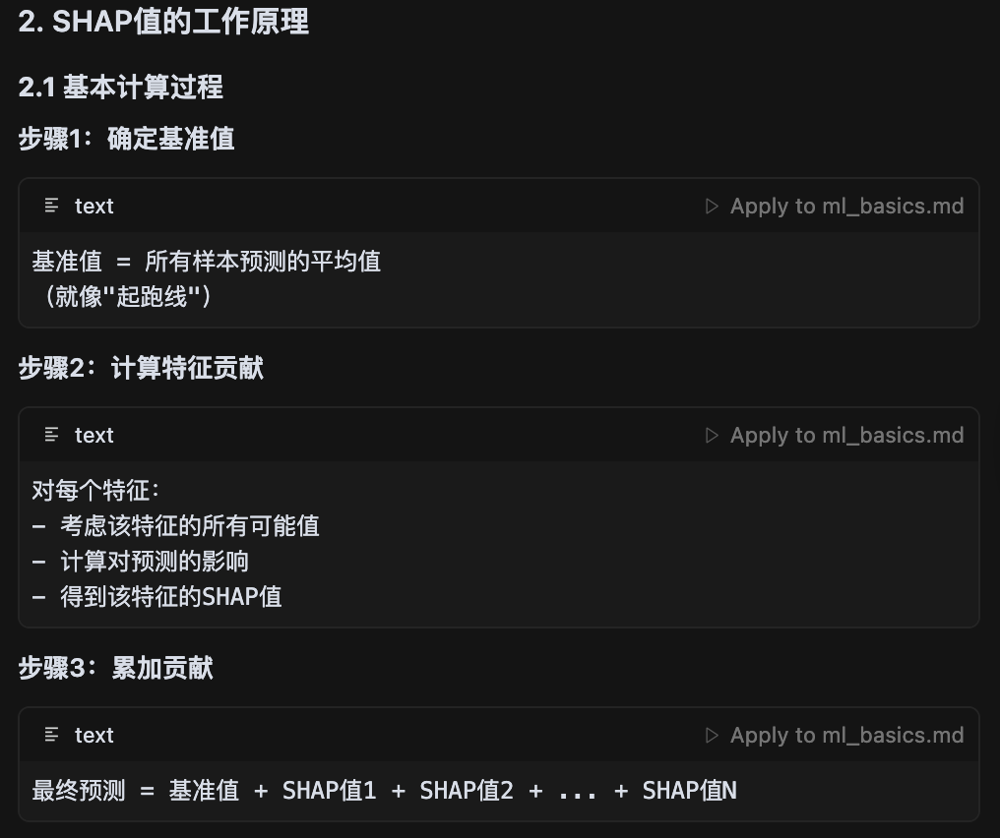

# 机器学习final cheat sheet
# 1. 基本概念
## 1.1 简述解决一个机器学习的流程？(machine learning process)
    - 确定问题：确定是有监督学习还是无监督学习，分类还是回归
    - 收集数据：收集数据，数据预处理
    - 特征工程：特征构建，特征选择，特征组合
    - 模型训练、调参、评估：包括模型的选择，选择最优的参数
    - 模型部署：模型在线上运行的效果直接决定模型的成败

Q1. 什么是有监督(supervised)与无监督(unsupervised)学习？  
最大的区别在于是否存在标签，有标签的是有监督学习，无标签的是无监督学习。无监督学习通常没有标签，所以只用通过一些无监督的算法来发现数据中的结构，比如聚类(k-means)，降维(PCA)，异常检测(孤立森林)。

注：半监督（semi-supervised）学习是介于监督学习和无监督学习之间的学习方式，通常是利用少量的标签数据和大量的无标签数据进行训练，从而提高模型的性能。

## 1.2 损失函数（loss function）是什么？
机器学习模型关于单个样本的预测值与真实值的差称为损失。用于计算损失的函数称为损失函数。常见的损失函数有：
- 均方误差（MSE）：$MSE = \frac{1}{n} \sum_{i=1}^{n} (y_i - \hat{y_i})^2$
- 平均绝对误差（MAE）：$MAE = \frac{1}{n} \sum_{i=1}^{n} |y_i - \hat{y_i}|$
- 交叉熵损失（Cross-Entropy Loss）：$CE = -\sum_{i=1}^{n} y_i \log(\hat{y_i})$

交叉熵损失函数：反映了预测的标签类别的概率分布（probability distribution）和真实标签类别的概率分布之间的差异。

MSE(Mean Squared Error) vs MAE(Mean Absolute Error): 
- MSE又叫L2 loss，MAE又叫L1 loss。
- MSE对异常值更敏感，MAE对异常值不敏感。
- MSE希望强罚大误差，而MAE则更加倾向于离群点多一点的样本。
- MSE对需要稳定、可微的训练过程：MSE 更平滑，易调参，且收敛速度快。


## 1.3 回归与分类模型的常用损失函数有哪些，各自的特点是什么？
(loss function)
- 回归：
    - MSE（L2）：平滑可导，重罚大误差；对离群点敏感。
    - MAE（L1）：鲁棒、逼近中位数；0 处不可导，收敛略慢，不方便求导。
    - Huber / Smooth L1：小误差用 L2、大误差用 L1，折中鲁棒与可导性。Huber loss 是 MSE 和 MAE 的结合。
    - Log-Cosh：近似MSE但对极端误差更温和，二阶可导（second-order differentiable）。

- 分类：
    - 交叉熵损失（Cross-Entropy Loss）：反映了预测的标签类别的概率分布和真实标签类别的概率分布之间的差异。
    - 负对数似然损失（Negative Log-Likelihood Loss


## 1.4 什么是结构误差和经验误差？训练模型的时候如何判断已经达到最优？(structural error and empirical error)
经验误差（empirical error）：模型在训练数据集上的误差。
结构误差（structural error）：模型是在经验风险上加上表示模型复杂度的正则化项，防止过拟合。


通俗理解：经验误差：模型在“自己做过的题”（训练集）上错了多少。——练习题成绩。而结构误差/结构风险：练习题错多少 + 你用了多复杂的套路（越复杂越扣分）。——练习成绩 + “作弊/花里胡哨度”罚分。

如何判断模型达到最优了: 训练时，使用validation set来判断模型是否达到最优，如果模型在validation set上的表现不再提升，则认为模型已经达到最优。

## 1.5 模型的泛化能力指什么？如何提高模型的泛化能力？(model generalization ability)
泛化能力（generalization ability）：模型在未知数据上(unseen data)的误差。

如何提高：
- 数据层面：多样干净的数据，data augmentation，数据增强(反转，噪声, mixup等)
- 模型与正则：降低复杂度（L1, L2, dropout, early stopping, weight decay, batch normalization, label smoothing）
- 训练策略：合适的learning rate，合适的batch size，合适的epochs，合适的optimizer，合适的loss function
- 集成与迁移：Bagging，Boosting，迁移学习

解释：
- 泛化能力对别


- L2正则化与weight decay：

口诀：L2 加到损失里，Weight Decay 直接加到权重里。

- Batch Normalization and label smoothing：
Batch Normalization（BN）是什么：对每一层的激活在小批量内做标准化，然后再用可学习的 γ,β 还原尺度。
Label smoothing是什么：将标签从 one-hot 转换为软标签，不给真类 100% 概率，改为 1-ε；其余类均分 ε，ε 是平滑系数，一般取 0.1。从而防止过拟合。

## 1.6如何选择合适的模型评估指标？AUC、精准度、召回率、F1值都是什么？如何计算？有什么优缺点？(model evaluation metrics)

1, TP, FP, TN, FN解释:
TP：将正类预测为正类数 (True Positive)
FN：将正类预测为负类数 (False Negative)
FP：将负类预测为正类数 (False Positive)
TN：将负类预测为负类数 (True Negative)

2, 准确率（Accuracy）：
准确率 = (TP + TN) / (TP + TN + FP + FN)
acc = accurate_count / total_count 分类正确的样本数 / 总样本数
缺点：不同类别的样本比例非常不均衡时，占比大的类别往往成为影响准确率的最主要因素。比如，当负样本占99%时，分类器把所有样本都预测为负样本也可以获得99%的准确率。
解决：可以使用每个类别下的样本准确率的算术平均（平均准确率）作为模型评估的指标。
一句话：准确率衡量模型把正样本预测为正样本以及把负样本预测为负样本的能力，更加关注样本整体的正确性。

3, 精准度（Precision）：
精准度 = TP / (TP + FP)
精准度 = 在我预测的正类中，有多少是真的正类
精准度越高，表示模型越能准确地预测正类。
一句话：精准度更加注重对正类的预测，假设垃圾邮件预测，我们更关心你是否预测对了垃圾邮件，而不是预测那些不是垃圾邮件的邮件。


4, 召回率（Recall）：
召回率 = TP / (TP + FN)
召回率越高，表示模型越能准确地预测正类。
召回率 = 在所有真正的正类中，我找到了多少，找到的比例高不高。

例子：

场景1：保守模型（只标记10封明显垃圾邮件）：1000封正常邮件，900封正常，100封垃圾邮件。

TP = 10 (True Positive)  
含义：预测为垃圾邮件，实际也是垃圾邮件    
解释：在100封真正的垃圾邮件中，模型正确识别出了10封   
结果：这10封被正确标记为垃圾邮件  

FP = 0 (False Positive)   
含义：预测为垃圾邮件，但实际是正常邮件    
解释：模型没有把任何正常邮件误判为垃圾邮件  
结果：0封正常邮件被错误标记为垃圾邮件  

TN = 890 (True Negative)  
含义：预测为正常邮件，实际也是正常邮件  
解释：在900封正常邮件中，模型正确识别出了890封 
结果：这890封被正确标记为正常邮件  

FN = 90 (False Negative)  
含义：预测为正常邮件，但实际是垃圾邮件  
解释：在100封真正的垃圾邮件中，模型漏掉了90封  
结果：这90封垃圾邮件被错误标记为正常邮件  

这个例子里recall = TP / (TP + FN) = (10 / 10 + 90) = 10%
也就是模型只找到了10%的垃圾邮件。

5, F1值：
F1值 = 2 * (precision * recall) / (precision + recall)
F1值是精准率和召回率的调和平均数，是精准率和召回率的加权平均数。
优点：
平衡性：同时考虑精准度和召回率
惩罚极端：一个指标很低时，F1值会很低
只有当精准率和召回率都很高时，F1值才会高。

5. Roc 曲线：
ROC曲线（Receiver Operating Characteristic Curve）是描述二分类模型性能的图形化工具，通过绘制不同分类阈值下的真阳性率(TPR)和假阳性率(FPR)来评估模型性能。

定义：
- 坐标轴定义
    - 横轴 (X轴)：FPR (False Positive Rate) = FP/(FP+TN)
    假阳性率，也叫1-特异性(1-Specificity)
    在所有负类样本中，被错误预测为正类的比例
    - 纵轴 (Y轴)：TPR (True Positive Rate) = TP/(TP+FN) = Recall
    真阳性率，就是召回率
    在所有正类样本中，被正确预测为正类的比例

好的Roc曲线，应该尽可能靠近左上角，也就是尽可能高的TPR和尽可能低的FPR。

AUC（Area Under Curve）：ROC曲线下的面积，是ROC曲线的面积。


6, AUC：(Area Under Curve) 
- 定义：是ROC曲线下的面积，是ROC曲线的面积。
可以看出，如果Roc曲线越好，就是ROC曲线越靠近左上角，那么曲线下的面积越大，也就是AUC越大。

- 什么是阈值？
    阈值是二分类问题中用来决定预测结果的分界线。

AUC的优点
i. 不受样本比例影响
优势：正负样本比例变化不影响AUC值
适用：极度不平衡数据集（如欺诈检测99:1）
ii. 考虑所有阈值

AUC的缺点
i. 无法直接解释不太直观

## 1.7 如何评判模型是过拟合还是欠拟合？遇到过拟合或欠拟合时，你是如何解决？(overfitting and underfitting)

当训练集效果差，欠拟合（如accuracy<0.8）；训练集效果好，测试集效果差，过拟合

欠拟合解决方法：
- 增加特征
- 提高模型复杂度：神经网络提高神经元数、增加层数；SVM使用核函数；
- 减小正则项的系数

过拟合解决方法：
- 提高样本数量 ：
    - 神经网络：Data Augmentation（数据增强）
- 简化模型：
    - 神经网络使用 Dropout、Early Stopping
    - 决策树剪枝、限制树的深度
- 加入正则化项（L1或L2）或提高惩罚系数
- 使用集成学习
- 神经网络中使用dropout机制
- early stopping
- 标签平滑（label smoothing）

## 1.8 你是如何针对应用场景选择合适的模型？
(model selection)
1, 问题的类型：
- 分类：逻辑回归(logistic regression)，决策树(decision tree)，随机森林(random forest)，支持向量机(support vector machine)，XGBoost(XGBoost)，神经网络(neural network)
- 回归：线性回归(linear regression)，随机森林(random forest), XGBoost(XGBoost)
- 聚类：K-means，DBSCAN，层次聚类(hierarchical clustering)

2, 数据类型：
- 规模：小数据用简单模型，大数据用深度学习，神经网络
- 维度：低维用线性模型，高维用正则化/降维
- 质量：噪声多用鲁棒模型，缺失值多用树模型

3, 业务目标：
- 可解释性：高要求用线性模型/决策树
- 实时性：实时用简单模型，批量用复杂模型
- 准确性：高精度用集成/深度学习
- 解释：线性模型跟决策树的可解释性好的原因：
    - 线性模型：
        - 权重 $w_i$：直接表示特征 $x_i$ 对预测结果的影响程度
        - 正负号：正权重表示正相关，负权重表示负相关
        - 大小：权重绝对值越大，该特征越重要
        - 房价 = 0.3 × 面积 + 0.1 × 房间数 - 0.05 × 距离市中心
    - 决策树：
        - 规则清晰性：决策路径：从根节点到叶节点的路径就是一条if-then规则
        - 特征分割点
            - 分割阈值：每个节点都有明确的分割条件
            - 信息增益：可以量化每个特征的重要性
            - 可视化：树结构可以直观展示
        - 决策过程透明
            - 路径追踪：可以追踪任何样本的决策过程
            - 条件组合：可以看到特征之间的交互作用
            - 局部解释：可以解释单个预测结果


4, 计算资源：
GPU不足，尽量用简单模型，因为深度学习训练需要大量GPU计算资源。

## 1.9 如何选择模型中的超参数？有什么方法，并说说其优劣点？(hyperparameter selection and optimization)
1, 常见超参数：
- 学习率(learning rate)：控制模型参数的更新速度，过小收敛慢，过大容易震荡。
- 正则化系数(regularization coefficient)：控制模型的复杂度，过小容易过拟合，过大容易欠拟合。
- 批量大小(batch size)：控制模型参数的更新速度，过小收敛慢，过大容易震荡。
- 迭代次数(epochs)：控制模型参数的更新速度，过小收敛慢，过大容易震荡。
- 隐藏层数量(hidden layers)：控制模型的复杂度，过小容易欠拟合，过大容易过拟合。
- 激活函数(activation function)
- 损失函数(loss function）

2, 超参数选择方法：
(hyperparameter selection and optimization)
- 网格搜索(Grid Search)：
网格搜索是一种超参数调优方法，通过在预定义的超参数空间中穷举所有可能的组合来找到最优的超参数设置，简单来说首先为每个超参数定义一个候选值列表，然后生成所有可能的参数组合，最后评估每个组合的性能，选择性能最好的组合。


- 随机搜索(Random Search)：
随机搜索是一种超参数调优方法，通过在超参数空间中随机采样来寻找最优的超参数组合，而不是穷举所有可能的组合，通过定义各个超参数的参数分布，然后随机采样，最后评估每个组合的性能，选择性能最好的组合。


- 贝叶斯优化(Bayesian Optimization)：
简单来说，贝叶斯优化是一种基于贝叶斯定理的超参数调优方法，通过构建一个代理模型（如高斯过程）来预测超参数的性能，然后根据预测结果选择下一个最优的超参数组合。（把参数的选择过程通过高斯过程回归来建模目标函数来选择下一个最优的参数）


## 1.10 误差分析是什么？你是如何进行误差分析？
(error analysis)
如果训练误差较高：说明模型的偏差较大，模型出现了欠拟合。
如果训练误差较低，而测试误差较高：说明模型的方差较大，出现了过拟合。
如果训练误差较低，测试误差也较低：说明模型的方差和偏差都适中，是一个比较理想的模型。
如果训练误差较高，且测试误差更高：说明模型的方差和偏差都较大。

## 1.11 你是如何理解模型的偏差和方差？什么样的情况是高偏差，什么情况是高方差？(bias and variance)
偏差 (Bias)
定义：模型预测值与真实值的系统性差异
数学：偏差 = E[f̂(x)] - f(x)
含义：反映模型的拟合能力  
方差 (Variance)
定义：模型预测值在不同数据集上的波动程度
数学：方差 = E[(f̂(x) - E[f̂(x)])²]
含义：反映模型的稳定性

理解：高偏差，仅仅bias就很高，所有预测跟实际系统性差很多，就是说模型没有学到数据背后的规律，就是欠拟合。而高方差，就是模型预测的值波动太大了 ，才能使得平方后，方差更大，这就解释说明模型为了fit更多的训练数据，使得模型过于复杂，从而导致过拟合。

好的模型应该偏差和方差都适中，就是偏差和方差都低。

## 1.12 出现高偏差或者高方差的时候你有什么优化策略？
(high bias or high variance)
高偏差：（模型欠拟合）(high bias and underfitting)
- 增加特征
- 提高模型复杂度：神经网络提高神经元数、增加层数；SVM使用核函数；
- 减小正则项的系数

高方差：（模型过拟合）(high variance and overfitting)
- 选择重要特征
- 减小模型复杂度：神经网络减少神经元数、减少层数
- 增加正则项的系数
- 使用集成学习， bagging减少方差
- 神经网络中使用dropout机制
- early stopping
- 标签平滑（label smoothing）

## 1.13 奥卡姆剃刀定律是什么？对机器学习模型优化有何启发？举例说明
奥卡姆剃刀定律（Occam's Razor）：
在解释同一现象时，假设越简单越好。也就是说，当有多个理论都能解释同一个现象时，应该选择最简单、假设最少的那个理论。  
- 核心思想：
    - 简单性优先：在同等解释力的前提下，选择最简单的模型
    - 避免过度复杂：不要为了解释而引入不必要的复杂性
    - 实用性导向：简单模型往往更实用、更稳定

## 1.14 线性模型和非线性模型的区别？哪些模型是线性模型，哪些模型是非线性模型？
判断依据：输出是否是输入的简单线性组合。  
y = f(w₁x₁ + w₂x₂ + ... + wₙxₙ + b) 非线性模型：f(x) 是 x 的非线性函数。

线性模型：
线性回归（linear regression)
逻辑回归（logistic regression)
线性支持向量机（linear SVM)
线性判别分析（linear discriminant analysis)

非线性模型：
决策树（decision tree)
随机森林（random forest)
支持向量机（support vector machine)
神经网络（neural network)
K近邻（K-nearest neighbors)
XGBoost(XGBoost)
Transformer(Transformer)


## 1.15 生成式模型和判别式模型的区别？哪些模型是生成式模型，哪些模型是判别式模型？
(generative model vs discriminative model)
生成式模型：可以生成数据，可以生成新的数据，比方生成图片，生成文本。
判别式模型：只能判别数据，不能生成新的数据。比方判别图片是否是猫，判别文本是否是垃圾邮件。

生成式模型：
朴素贝叶斯（naive Bayes)
高斯混合模型（Gaussian mixture model)
隐马尔可夫模型（hidden Markov model)
GPT(Generative Pre-trained Transformer)
VAE(Variational Autoencoder)
GAN(Generative Adversarial Network)

判别式模型：
逻辑回归（logistic regression)
支持向量机（support vector machine)
决策树（decision tree)
随机森林（random forest)
神经网络（neural network)
卷积神经网络（convolutional neural network)

## 1.16 概率模型和非概率模型的区别？哪些模型是概率模型，哪些模型是非概率模型？
(probabilistic model vs non-probabilistic model)
概率模型 P(y|x)：输出是一个概率分布，对于每个输入x，输出y有多种可能，每种可能都有对应的概率。模型告诉我们"y取某个值的概率是多少"  
非概率模型 y = f(x)：
输出是一个确定性值，对于每个输入x，输出y是唯一确定的。

一般来说，生成式模型是概率模型，判别式模型是非概率模型。

## 1.17 参数化模型和非参数化模型的区别？哪些模型是参数化模型，哪些模型是非参数化模型？（parametric model vs non-parametric model）
区别依据：模型参数数量是否固定，参数化模型参数数量固定，不管数据量多少，参数数量不变，非参数化模型参数数量不固定，数据量增加，参数数量增加。

参数化模型：
线性回归（linear regression)
逻辑回归（logistic regression)
朴素贝叶斯（naive Bayes)
神经网络（neural network)

非参数化模型：
决策树、k近邻

# 2. 经典机器学习算法
## 2.1 你是怎样理解“特征”？
(feature)
- 定义：数据的特征是数据中可以用来预测目标变量的属性。
- 特征的分类：
    - 连续特征：实数，如身高、体重
    - 离散特征：类别，如颜色、性别
    - 文本特征：文本，如评论、新闻
    - 时间序列特征：时间序列，如股票价格、天气

## 2.2 开发特征时候做如何做数据探索，怎样选择有用的特征？(data exploration and feature selection)
- 特征的相关性分析：Correlation Analysis

## 2.3 如何发现数据中的异常值，你是如何处理？
1. 异常值处理方法：
    - 缺失值较多.直接将该特征舍弃掉，否则可能反倒会带入较大的噪声，对结果造成不良影响。
    - 缺失值较少,其余的特征缺失值都在10%以内，我们可以采取很多的方式

2. 如何处理:
    - 把NaN直接作为一个特征，假设用0表示； （离散特征取值k维扩充到k+1维）
    - 用均值填充； （连续特征-均值，离散特征-特征取值的众数）
    - 用随机森林等算法预测填充


## 2.4 对于数值类型数据，你会怎样处理？为什么要做归一化？归一化有哪些方法？离散化方法，离散化和归一化有哪些优缺点？
(numerical data processing and normalization)

为了消除数据特征之间的量纲影响，我们需要对特征进行归一化处理，使得不同指标之间具有可比性。以梯度下降过程为例，如果不做归一化，在学习速率相同的情况下，大量纲变量的更新速度会大于小量纲，需要较多迭代才能找到最优解。如果将其归一化到相同的数值区间后，更新速度变得更为一致，容易更快地通过梯度下降找到最优解。

常见归一化方法：
1. Min-Max归一化：
    - 公式：$x' = \frac{x - x_{min}}{x_{max} - x_{min}}$
    - 优点：简单直观，保持零值，适合有界数据
    - 缺点：对异常值敏感，新数据可能超出[0,1]范围
2. Z-Score归一化：
    - 公式：$x' = \frac{x - x_{mean}}{x_{std}}$
    - 优点：对异常值不敏感，适合正态分布数据
    - 缺点：不保证数据在特定区间内，可能产生负值


## 2.5 类别特征如何处理？
- 独热编码（One-Hot Encoding）：将类别特征转换为二进制向量，每个类别对应一个二进制位。
- 标签编码（Label Encoding）：将类别特征转换为整数，每个类别对应一个整数。
- 特征嵌入（Feature Embedding）：将类别特征转换为低维向量，每个类别对应一个向量。将高纬度的类别特征转换为低纬度的向量特征，从而减少维度灾难。

例子：
独热编码的问题
cities = ['北京', '上海', '广州', '深圳', '杭州', '南京', '成都', '重庆', '武汉', '西安']  
独热编码后：10个城市 -> 10个特征

嵌入编码的解决方案  
embedding_dims = 4    
10个城市 -> 4个特征  
大大减少了特征维度  

优点：
- 降低维度：高基数类别（如城市、商品ID）从几百维降到几维
- 减少内存：显著减少模型存储空间
- 加速训练：降低计算复杂度，加快收敛速度

## 2.6 序列类型数据你的处理方法是什么？原因？(sequence data processing)

序列特征：具有时间顺序或位置顺序的数据，如文本序列、时间序列、行为序列等。  
特点：
- 顺序性：元素之间有明确的顺序关系
- 依赖性：后续元素可能依赖于前面的元素
- 变长性：序列长度可能不固定
- 上下文性：元素的意义依赖于上下文

处理方法：
- 词袋模型：将序列转换为词袋模型，每个词对应一个特征。
    1. 分词：将序列转换为单词
    2. 去停用词：去除常见的无意义词
    3. 统计词频：统计每个词出现的频率
    4. 构建词袋：将词频向量化
    5. 缺点：丢失了词序信息，无法捕捉词之间的顺序关系
    
- 词嵌入模型：将序列转换为词嵌入模型，每个词对应一个向量。
    1. 分词：将序列转换为单词
    2. 去停用词：去除常见的无意义词
    3. 构建词嵌入：将词频向量化
    

## 2.7 Word2vec和LDA两个模型有什么区别和联系？(word2vec and LDA)
Word2Vec：一种词嵌入模型，通过训练神经网络来学习词的向量表示。
LDA：一种主题模型，通过训练贝叶斯模型来学习词的分布。


## 2.8 线性回归与逻辑回归的区别？
线性回归：输出是连续值，预测的是连续值。
逻辑回归：输出是离散值，预测的是离散值。


# 支持向量机
## 2.9 简单讲解SVM模型原理？(SVM model)
1，原理
SVM的核心思想是找到一个最优超平面来分隔不同类别的数据，(hyperplane)使得：
    - 间隔最大化：两类数据点到超平面的距离尽可能大
    - 分类正确：所有数据点都被正确分类

2，三种类型：
- 线性可分支持向量机：当训练数据线性可分，通过硬间隔最大化，学习一个线性的分类器
- 线性支持向量机：当训练数据近似线性可分，通过软间隔最大化，学习一个线性的分类器
- 非线性支持向量机：当训练数据线性不可分，通过使用核技巧及软间隔最大化，学习非线性分类器

## 2.10 SVM为什么会对缺失值敏感？实际应用时候你是如何处理？
SVM基于距离计算：
    - SVM的核心是计算数据点到超平面的距离
    - 缺失值会导致距离计算不准确

## 2.11 常用的核函数有哪些？你是如何选择不同的核函数的？(kernel function)
- 核函数的主要作用：
    - 非线性映射：将低维空间的数据映射到高维空间
    - 内积计算：在高维空间中计算内积，而不需要显式计算映射
    - 非线性分类：使原本线性不可分的数据在高维空间中线性可分

- 常用核函数：
    - 线性核函数：（linear kernel）
    - 多项式核函数：（polynomial kernel）
    - 高斯核函数RBF：（gaussian kernel）

        高斯径向基函数是一种局部性强的核函数，其可以将一个样本映射到一个更高维的空间内，该核函数是应用最广的一个，无论大样本还是小样本都有比较好的性能，而且其相对于多项式核函数参数要少，因此大多数情况下在不知道用什么核函数的时候，优先使用高斯核函数。

## 2.12 SVM属于线性模型还是非线性模型？为什么？
基本模型是一个线性分类器；而通过使用核函数可以学习非线性支持向量机。

## 2.13 当用支持向量机进行分类时，支持向量越多越好还是越少越好
结论：在n维特征空间中，线性SVM一般会产生n+1个支持向量（不考虑退化情况）

通常的SVM的使用会伴随着核技巧（kernel），这用于将低维空间映射到一个更高维的空间，使得原本不线性可分的数据点变得在高维空间中线性可分。虽然这种映射是隐式的，我们通常并不知道映射到的空间是什么样子。但是根据之前的结论，我们可以认为如果训练出来的SVM有d+1个支持向量，这个kernel在这个任务里就讲原来的数据映射到了一个d维的空间中，并使得其线性可分。

更高的维度通常意味着更高的模型复杂度，所以支持向量越多，表示着训练得到的模型越复杂。根据泛化理论，这意味着更有过拟合的风险。

如果在性能一致的情况下，更少的支持向量可能是更好的。但是这一点其实不绝对，因为泛化理论仅仅是误差的上界，实际的泛化情况的决定因素比较复杂，也可能取决于kernel的性质。所以还是自己做cross validation比较好。

支持向量机中向量的含义：在支持向量机中，"向量"指的是数据点在特征空间中的表示。

# 朴素贝叶斯模型
## 2.14 讲解贝叶斯定理？
P(A|B) = P(B|A) * P(A) / P(B)
P(A|B)：在B发生的条件下A发生的概率（后验概率）（posterior probability）检查为阳性的条件下，患病概率
P(B|A)：在A发生的条件下B发生的概率（似然概率）（likelihood probability）患病并检测为阳性的概率
P(A)：A发生的先验概率（prior probability）患病概率
P(B)：B发生的总概率（evidence）检测为阳性的概率

A: 患病，B: 阳性
已知检测结果为阳性，求患病概率：
P(患病|阳性) = P(阳性|患病) * P(患病) / P(阳性)

## 2.15 什么是条件概率、边缘概率、联合概率？（conditional probability, marginal probability, joint probability）
条件概率：P(A|B) = P(A,B) / P(B)
边缘概率：P(A) = P(A,B) / P(B)
边缘概率指在联合概率中，将其中一个变量固定，求另一个变量的概率。
联合概率：P(A,B) = P(A|B) * P(B)

## 2.16 朴素贝叶斯模型如何学习的？训练过程是怎样？
对于给定的训练数据集，首先基于特征条件独立性假设学习输入输出的联合概率分布；然后基于此模型，对给定的输入x，利用贝叶斯定理求出后验概率最大的输出y。

## 2.17 朴素贝叶斯模型“朴素”体现在哪里？存在什么问题？有哪些优化方向？
对条件概率分布做了条件独立性的假设，即假设各个特征之间相互独立。

问题：
- 特征之间相互独立性假设在实际应用中往往不成立，导致模型性能下降。

优化方向：
- 特征选择：选择最相关的特征，减少特征之间的相关性。
- 特征组合：将多个特征组合成一个特征，减少特征之间的相关性。
- 贝叶斯网络：将特征之间的依赖关系建模为贝叶斯网络，从而提高模型性能。

# 决策树
## 2.18 讲解完成的决策树的建树过程？
自上而下，对样本数据进行树形分类的过程。每个内部节点表示一个特征，叶节点表示一个类别。从顶部根节点开始，所有的样本聚在一起。经过根节点的划分，样本被分到不同的子节点，再根据子节点的特征进一步划分，直至所有样本被归到某一个类别（叶节点）中。

## 2.19 你是如何理解熵？从数学原理上解释熵公式可以作为信息不确定性的度量？（information uncertainty）

熵的基本概念：
熵是衡量信息不确定性的度量，不确定性越大 → 熵越大，确定性越大 → 熵越小，完全确定 → 熵为0。

## 2.20 联合熵、条件熵、KL散度、信息增益、信息增益比、gini系数都是什么？如何计算？

- 联合熵 (Joint Entropy)：衡量两个或多个随机变量联合分布的不确定性
    - 公式：H(X,Y) = -∑∑P(x,y)logP(x,y)

- 条件熵 (Conditional Entropy)：在给定随机变量Y的条件下，随机变量X的不确定性
    - 公式：H(X|Y) = -∑∑P(x,y)logP(x|y)

- KL散度 (Kullback-Leibler Divergence)：衡量两个概率分布之间的差异
    - 公式：D(P||Q) = ∑P(x)log(P(x)/Q(x))

- 信息增益 (Information Gain)：衡量在给定随机变量Y的条件下，随机变量X的不确定性减少的程度
    - 公式：IG(X|Y) = H(X) - H(X|Y)

- 信息增益比 (Information Gain Ratio)：衡量在给定随机变量Y的条件下，随机变量X的不确定性减少的程度
    - 公式：IGR(X|Y) = IG(X|Y) / H(X)

- Gini系数 (Gini Coefficient)：衡量随机变量X的不确定性
    - 公式：Gini(X) = 1 - ∑P(x)^2

每个判断点：就是一个分割，就是一个决策，就是一个特征条件。
信息增益用于衡量判断点对分类结果的影响力，如果信息增益越大，说明这个判断点对分类结果的影响力越大，这个判断点越重要，就是我们的重要特征。

## 2.21 常用的决策树有哪些？ID3、C4.5、CART有啥异同？

ID3: 信息增益（Information Gain）
使用信息增益作为分割标准，只支持离散特征，只支持分类问题。算法流程，计算根节点的信息熵，对每个特征计算信息增益，选择信息增益最大的特征作为分割特征，根据特征值分割数据，对每个子节点递归执行上述过程，直到节点纯或无可用特征。

C4.5: 信息增益比
使用信息增益比作为分割标准，支持离散特征和连续特征，支持分类和回归问题。算法流程，计算根节点的信息熵，对每个特征计算信息增益比，选择信息增益比最大的特征作为分割特征，根据特征值分割数据，对每个子节点递归执行上述过程，直到节点纯或无可用特征。

CART: 基尼系数
计算根节点的Gini系数，对每个特征计算Gini减少量，选择Gini减少量最大的特征作为分割特征，对于连续特征，找到最优分割点，根据特征值分割数据（二元分割），对每个子节点递归执行上述过程，应用剪枝减少过拟合。

## 2.22 决策树如何防止过拟合？前剪枝和后剪枝过程是怎样的？剪枝条件都是什么？
1， 预剪枝（Pre-pruning）：在树构建过程中提前停止生长，设置停止条件，防止树过度生长  
2， 后剪枝（Post-pruning）：先构建完整树，然后剪掉不必要的分支，用验证集评估，剪掉有害的分支

3， 剪枝条件：
    - 限制树的深度
    - 限制节点的最小样本数
    - 限制最小信息增益


后剪枝：


# 随机森林
## 2.23 介绍RF原理和思想？（random forest）


## 2.24 随机森林的优缺点？
随机森林：一种集成学习方法，通过构建多个决策树并将它们的预测结果进行组合，从而提高模型的泛化能力。（多棵树投票）
随机森林是一种集成学习。（集成学习：ensemble learning）

Bagging：Bootstrap Aggregating，通过有放回的抽样，构建多个训练集，训练多个决策树，然后投票。

组成：多个决策树：通常是CART树，随机性：数据随机采样 + 特征随机选择，集成策略：投票（分类）或平均（回归）。

随机森林构建流程：


Boostrap采样 == Bagging有放回的抽样，构建多个训练集，训练多个决策树。数据多样性，模型多样性，减少过拟合。

分类问题:
- 具体过程：
    - 将输入样本输入到每棵决策树
    - 每棵树给出类别预测
    - 统计各类别的票数
    - 选择票数最多的类别作为最终预测（投票）（voting）

回归问题：
- 具体过程：
    - 将输入样本输入到每棵决策树
    - 每棵树给出预测值
    - 统计所有预测值的平均值作为最终预测

## 2.25 RF是如何处理缺失值？
- 代理分割：如果当前节点存在缺失值， 使用代理特征进行分割。


- 删除法：删除包含缺失值的样本。
- 统计填充法：使用其他特征的平均值来代替缺失值。或者中位数。

## 2.26 RF如何衡量特征重要度？
如果特征对决策树的分类结果影响越大，则特征重要度越高。
1. 基于不纯度减少的总和（Gini系数）
2. 基于SHAP值

- SHAP值：
    - 什么是SHAP值
    - SHAP = SHapley Additive exPlanations
    - 通俗理解：
        - SHAP值就像"贡献度"
        - 每个特征对预测结果的"功劳"


## 2.27 RF“随机”主要体现在哪里？
1. 数据随机性（Bootstrap采样）
2. 特征随机性（随机特征选择）（100个特征，每个节点分割时，随机从100个选10个，然后从10个中选最优分割，每个节点选择不同的特征子集。）


## 2.28 RF有哪些优点和局限性？
优点：
- 泛化能力强：不容易过拟合，训练集和测试集性能接近
- 预测准确：集成多个树，减少个体错误
- 稳定性好：对噪声和异常值不敏感

局限性：
- 训练时间长：需要训练多个决策树
- 内存消耗大：需要存储多个决策树
- 解释性差：不容易解释每个特征的重要性，因为每个特征的重要性是基于所有树的贡献度计算的。整体模型的黑盒性。

## 2.29 为什么多个弱分类器组合效果会比单个要好？如何组合弱分类器可以获得更好的结果？原因是什么？
- 单个强分类器的问题：
    - 高方差：容易过拟合，对噪声敏感
    - 不稳定：预测结果波动大
    - 泛化差：训练集和测试集性能差距大
- 多个弱分类器组合：
    - 方差平均化：多个模型的方差被平均
    - 稳定性提升：单个模型的错误被稀释
    - 泛化增强：集体决策更稳定

## 2.30 Bagging的思想是什么？它是降低偏差还是方差，为什么？
Bagging的思想是通过对数据再抽样，然后在每组样本上训练出来的模型取平均。Bagging是降低方差，防止过拟合。可以这样理解，对n个独立不相关的模型的预测结果取平均，方差是原来单个模型的 1/n。

## 2.31 可否将RF的基分类模型由决策树改成线性模型或者knn？为什么？
替换为线性模型（基本不可行，除非是线性可分问题：线性回归，或逻辑回归）
1. 替换成线性模型，多样性不足，模型容易欠拟合
2. 随机性有限，线性模型对随机性不敏感。


替换为knn：（可行，但效果不如决策树）
1. knn每次计算都需要计算所有样本的距离，计算量太大。
2. 随机性有限，knn对数据采样敏感低。
3. knn需要存储所有样本，内存消耗大，而决策树只需要存储树结构。

# KNN算法（K-Nearest Neighbors）
## 2.32 介绍KNN算法原理？
思路：相似的样本属于同一个类别，通过距离（欧氏距离，曼哈顿距离，闵可夫斯基距离）来判断相似度，选择距离最近的K个样本，根据K个样本的类别，通过投票选择出现次数最多的类别作为预测结果。

缺点：
1. 计算量大，需要计算所有样本的距离。
2. 对数据采样敏感，需要存储所有样本，内存消耗大。

- 三种点类型：
    - 邻居点：距离最近的K个样本
    - 非邻居点：距离较远的样本
    - 边界点：距离最近的K个样本中，类别不一致的样本


# GBDT（Gradient Boosting Decision Tree）梯度提升决策树
## 2.33 介绍GBDT原理？
思路：通过串行训练多个决策树，每个决策树学习前一个决策树的残差（梯度），最终将多个决策树的结果加权组合得到最终结果。（训练多个弱学习器，组成一个强学习器）

残差学习：（Gradient Boosting)
每个树学习前面模型的错误，逐步减少预测误差，实现渐进式改进。

梯度提升：（Gradient Boosting）
使用梯度下降法优化损失函数，通过梯度方向更新模型参数，逐步逼近最优解。（现代神经网络的方法）

## 2.34 梯度提升和梯度下降有什么区别和联系？
相同点：
- 都使用负梯度方向进行优化
- 都采用迭代更新的方式
- 都朝着损失函数下降的方向

不同点：
- 梯度下降优化的是参数
- 梯度提升优化的是模型
- 梯度下降：θₜ₊₁ = θₜ - α∇L(θₜ)
- 梯度提升：Fₜ₊₁(x) = Fₜ(x) - α∇L(Fₜ(x))


## 2.35 你是如何理解Boosting和Bagging？他们有什么异同？
Boosting：（知错就改， 善莫大焉。）
- 串行训练多个弱学习器
- 每个新模型重点关注前面模型的错误
- 通过加权组合提升整体性能

Bagging：（三个臭皮匠，顶个诸葛亮。）
- 并行训练多个弱学习器
- 每个模型独立训练，关注不同的数据（数据随机采样）
- 通过投票或平均提升整体性能

Boosting: Random Forest
Bagging: GBDT, XGBoost

## 2.36 你是如何理解GBDT和XGBoost？他们有什么异同？
GBDT：（Gradient Boosting Decision Tree）
XGBoost：（eXtreme Gradient Boosting）

XGBoost：考虑了正则项，防止过拟合。对GDDT做了优化。
- 目标函数：min Σ L(yᵢ, F(xᵢ)) + Ω(F)，包含损失函数和正则化项
- 正则化项：Ω(F) = γT + 0.5λΣw²

## 2.37 讲解GBDT的训练过程？
1. 初始化模型：F₀(x) = 0
2. 计算残差：rₜ = y - Fₜ(x)
3. 训练新模型：Fₜ₊₁(x) = Fₜ(x) + αhₜ(x)
4. 更新模型：F(x) = Fₜ₊₁(x)
5. 重复2-4步，直到达到预设的迭代次数或误差阈值
6. 输出最终模型：F(x)
用每个样本的残差训练下一棵树，直到残差收敛到某个阈值以下，或者树的总数达到某个上限为止。

## 2.38 GBDT的优点和局限性有哪些？
优点：
- 高准确率：通过集成多个决策树，提高模型的准确率
- 鲁棒性强：对噪声数据和异常值有较好的鲁棒性
- 可处理高维数据：可以处理高维数据，不需要特征选择

缺点：
- 训练时间长：需要训练多个决策树，串行训练，无法并行化。
- 每棵树都需要顺序训练，无法并行化。
- 内存消耗大：需要存储多个决策树，内存消耗大。
- 可解释性差：模型负责难以理解。


## 2.39 如何防止GBDT过拟合？
- 学习率 learning rate，小的学习率让模型迭代更慢，提高泛化能力
- 正则化，减低每棵树的贡献，防止过拟合。
- 限制树的深度，限制单棵树的复杂度，避免过度分割。
- 子采样 subsample，每次采样数据，增加随机性，减少过拟合。
- early stopping，设置一个验证集，当模型在验证集上的性能不再提升时，停止训练。


## 2.40 在训练GBDT过程中哪些参数对模型效果影响比较大？这些参数造成影响是什么？
- 学习率 learning rate，每个弱学习器的权重缩减系数，也就是步长
- 正则化系数，防止过拟合，减低每棵树的贡献。
- n_estimators，弱学习器的数量，也就是树的数量。n_estimators要适中，太小容易欠拟合，太大容易过拟合。
- max_depth，树的深度，限制单棵树的复杂度，避免过度分割。
- subsample, 推荐在[0.5, 0.8]之间，选择小于1的比例可以减少方差，防止过拟合。

# K-Means聚类算法
## 2.41 介绍K-Means聚类算法原理？
思路：将数据集划分为K个簇，每个簇的中心是簇内所有样本的均值。
1. 随机选择K个初始中心点
2. 将每个样本分配到距离最近的中心点
3. 更新中心点为簇内所有样本的均值
4. 重复2-3步，直到中心点不再变化或达到最大迭代次数

## 2.42 Kmeans损失函数是如何定义？
- 损失函数：J = Σᵢ₌₁ⁿ Σₓ∈Cᵢ ||x - μᵢ||²
    - n：样本数量
    - k：聚类数量
    - Cᵢ：第i个聚类
    - μᵢ：第i个聚类的中心
    - ||x - μᵢ||²：样本x到聚类中心μᵢ的欧几里得距离的平方

- 衡量所有样本到其聚类中心的距离，距离越小，聚类效果越好，目标是最小化总距离。
- 收敛条件：聚类中心不再变化，或损失函数不再下降。

## 2.44 你是如何选择初始类族的中心点？
- 选择方式：
    - 随机选择K个初始中心点
    - 可以用层次聚类的方式，先聚类成K个簇，然后从每个簇中选择一个离中心点最近的点作为初始中心点

- 类别K的选择：
    - k值需要预先指定，而在实际应用中最优的k值是不知道的。解决这个问题的一个方法是尝试用不同的k值聚类，检验各自得到聚类结果的质量，推测最优的k值。
    - 一般地，类别数变小时，平均直径会增加；类别数变大超过某个值后，平均直径会不变；而这个值是最优的k值。实验时可以采用二分查找，快速找到最优的k值。
    - 手肘法（Elbow Method）：
        - 随着聚类数量k增加：
            - 开始时：误差下降很快（效果明显改善）
            - 到某个点：误差下降变慢（改善不明显）
            - 这个"转折点"就是最优k值
        - 尝试不同的K值，并将不同K值所对应的损失函数化成折线，横轴为K的取值，纵轴为误差平方和所定义的损失函数。K值越大，距离和越小。当K=K'时，存在一个拐点，像人的肘部。当 K>K'，曲线趋于平稳。手肘法认为拐点就是K的最佳值。

    


## 2.45 如何提升kmeans效率？
- kmeans时间复杂度 O(nkt) n，k，t分别为样本数，聚类中心数，迭代轮次
    - 使用kd树（k-dimension tree）以及ball树（ball tree）（数据结构）来提高k-means算法的效率。（KNN计算的优化）
    - 并行计算（GPU加速，并行计算更新聚类中心）

## 2.46 常用的距离衡量方法有哪些？他们都适用什么类型问题？
- 欧几里得距离(Euclidean Distance)：适用于连续型数据，如欧几里得距离，曼哈顿距离(Manhattan Distance)，闵可夫斯基距离(Minkowski Distance)。
- 余弦距离(Cosine Distance)：适用于文本数据，如余弦距离，余弦相似度。
- 汉明距离(Hamming Distance)：适用于二进制数据，如汉明距离，汉明相似度。


## 2.47 Kmeans对异常值是否敏感？为什么？
- 敏感，因为需要计算距离，使用传统的欧式距离度量方式。所以需要预处理离群点、数据归一化。

## 2.48 如何评估聚类效果？
1. 纯度（Purity）：
    - 对每个聚类，找到最多的真实标签
    - 计算该标签在聚类中的数量
    - 所有聚类的最大值求和
    - 除以总样本数
2. 归一化互信息（NMI: Normalized Mutual Information）：
    - 聚类结果和真实标签共享多少信息
    - 共享信息越多，聚类效果越好
    - 就像两个朋友有多少共同话题
    - 聚类与标签的互信息
    - 计算公式：NMI = I(X, Y) / [H(X) + H(Y)] / 2
    - I(X, Y)：X和Y的互信息
    - H(X)：X的熵
    - H(Y)：Y的熵

3. 熵（Entropy）：
    - 好的分组（低熵）：
        - A组：全是男生
        - B组：全是女生
        - 确定性高，熵低
    - 差的分组（高熵）：
        - A组：男女各半
        - B组：男女各半
        - 确定性低，熵高
    - 公式：H(C) = -Σᵢ₌₁ᵏ P(Cᵢ) log P(Cᵢ)
        - P(Cᵢ) = |Cᵢ|/N
        - 熵越小，聚类越整齐
        - 熵越小，不确定性越低
        - 熵越小，聚类质量越高


## 2.49 Kmeans有哪些优缺点？是否有了解过改进的模型，举例说明？
- 优点：
    - 对于大数据集，kmeans聚类算法相对是可伸缩和高效的，它的计算复杂度是$O(NKt)$ 接近线性，其中N是样本数，K是聚类的簇数，t是迭代的轮数。
    - 尽管算法经常以局部最优解结束，但一般情况下达到的局部最优已经可以满足聚类的需求。
    - 算法简单，容易实现。

- 缺点：
    - 受初值和离群点的影响，每次的结果不稳定
    - 结果通常不是全局最优而是局部最优解
    - 无法很好地解决数据簇分布差别比较大的情况（比如一类是另一类样本数量的100倍）
    - 不太适用于离散分类
    - K值需要人工预先确定，且该值和真实的数据分布未必吻合【最大缺点】
    - 样本点只能被划分到单一的类中
    - 计算复杂度高，需要对所有样本计算距离，时间复杂度高。

- 改进的模型：
    - K-means++：
        - 智能初始化：距离加权选择初始中心（选了一个中心点后，距离这个中心点越远的点，被选中为下一个中心点的概率越大）
        - 均匀分布：避免中心聚集
        - 快速收敛：减少迭代次数
        - 结果稳定：提高可重现性

## 2.50 除了kmeans聚类算法之外，你还了解哪些聚类算法？简要说明原理
层次聚类（Hierarchical Clustering）：层次聚类（hierarchical clustering）假设类别之间存在层次结构，分为聚合（自下而上）和分裂（自上而下）两种方法。聚合法开始讲每个样本各自分到一个类；之后将相邻最近的两类合并（根据类间距离最小合并规则），建立一个新的类，重复此操作直到满足停止条件（类的个数达到阈值/类的直径超过阈值）；得到层次化的分类。分裂法开始讲所有样本分到一个类；之后将已有类中相距最远的样本分到两个新的类，重复此操作直到满足停止条件；得到层次化的分类。（实现大类包小类的效果）

基于密度的方法DBSCAN：
DBSCAN（Density-Based Spatial Clustering of Applications with Noise）是一种基于密度的聚类算法，它将簇定义为密度相连的点的最大集合，能够发现任意形状的簇。

特点：
- 不是基于距离，而是基于密度
- 高密度区域形成聚类
- 低密度区域作为噪声
- 自动发现任意形状的聚类

关键参数：
- 半径Eps：邻域半径，决定邻居范围
- 最小点数MinPts：核心点邻居数量阈值，决定簇形成的最小密度与规模

三种点：
- 核心点：在半径Eps内含有超过MinPts个样本的点
- 边界点：在半径Eps内含有小于MinPts个样本的点
- 噪音点：既不是核心点也不是边界点的点

算法流程：
1. 选择初始点，检查邻居点数量
2. 核心点：形成新簇
3. 边界点：加入最近簇
4. 噪音点：忽略
5. 重复1-4步，直到所有点都被处理
6. 输出聚类结果
7. 输出噪音点

# 3. 深度学习
# DNN
## 3.1 描述一下神经网络？推导反向传播公式？
1.1 核心思想：
 - 模拟人脑神经元：
    - 多个输入 → 加权求和 → 激活函数 → 输出
    - 神经元之间相互连接
    - 通过调整权重学习

1.2 神经网络结构：
- 每一层神经元：
    - 神经元输出：y = f(Σᵢ wᵢxᵢ + b)
    - 其中：
        - xᵢ：输入
        - wᵢ：权重
        - b：偏置
        - f：激活函数
- 多层神经元：
    - 输入层：原始数据
    - 隐藏层：中间层，学习特征
    - 输出层：最终结果
- 前向传播：
    - 输入 → 隐藏层 → 输出层
    - 计算输出：y = f(Σᵢ wᵢxᵢ + b)
- 激活函数：
    - Sigmoid：将输出映射到0-1之间，适合二分类问题
    - ReLU：将负数映射为0，正数不变，适合深层网络
    - Tanh：将输出映射到-1到1之间，适合深层网络
    - Softmax：将输出映射到0-1之间，适合多分类问题
    - 激活函数的作用：
        - 非线性：允许网络学习复杂模式
        - 连续可导：方便计算梯度
- 全连接层：
    - 每个神经元与上一层所有神经元连接

- 反向传播：
    - 计算梯度：
        - 损失函数对权重和偏置的梯度
        - 使用链式法则
    - 更新参数：
        - 梯度下降法（GD）：计算所有样本的梯度，更新参数
        - 随机梯度下降法（SGD）：计算一个样本的梯度，更新参数
        - 小批量梯度下降法（Mini-batch GD）：计算一批样本的梯度，更新参数

- 损失函数：
    - 均方误差（MSE）：计算预测值与真实值的平方差（回归问题）
    - 交叉熵损失：计算预测值与真实值的交叉熵（多分类问题）
    - 对数损失：计算预测值与真实值的对数损失（二分类问题）

- 反向传播梯度计算：
    - ∂L/∂w = ∂L/∂a · ∂a/∂z · ∂z/∂w
    - 计算每个参数的梯度：
        - ∂L/∂W^(l)
        - ∂L/∂b^(l)


## 3.2 讲解一下dropout原理？
在神经网络前向传播的时候，让某个神经元的激活值以一定的概率p停止工作，这样可以使模型泛化性更强，因为它不会太依赖某些局部的特征。比如当前层有100个神经元，dropout概率为0.5，那么每个神经元有50%的概率被保留，50%的概率被丢弃。


## 3.3 梯度消失和梯度膨胀的原因是什么？有什么方法可以缓解？（Gradient Exploding and Vanishing）

- 梯度消失原因：
    - 激活函数导数太小
    - 权重初始化过小，多层连乘导致梯度越来越小
    - 网络层数过深，梯度在反向传播中逐渐减小

- 梯度膨胀原因：
    - 激活函数导数太大
    - 权重初始化过大，多层连乘导致梯度越来越大

- 梯度消失解决方法：
    - 使用ReLU、Leaky等激活函数，保证梯度流动
    - 权重初始化改进，使用Xavier初始化方法，保证每层输入输出的方差一致
    - 使用残差连接，保证梯度流动（ResNet）
    - Batch Normalization，保证每层输入输出的方差一致，梯度更稳定

- 梯度膨胀解决方法：
    - Gradient Clipping：梯度裁剪，限制梯度大小
    - 权重正则化，L2惩罚权重，限制权重大小

## 3.4 什么时候该用浅层神经网络，什么时候该选择深层网络？
- 浅层网络：
    - 数据量小，特征少，特征维度低
    - 问题复杂程度低，线性可分问题
    - 计算资源有限，计算速度快

- 深层网络：
    - 数据量大，特征多，特征维度高
    - 端到端学习，特征工程困难
    - 问题复杂程度高，非线性可分问题
    - 计算资源充足，计算速度慢

## 3.5 Sigmoid、Relu、Tanh激活函数都有哪些优缺点？
- Sigmoid：
    - 计算公式：sigmoid(x) = 1 / (1 + e^-x)
    - 优点：
        - 输出在0-1之间，适合概率问题
    - 缺点：
        - 需要计算指数（exponential computation），速度慢
        - 梯度消失问题，导数在两端趋近于0

- Tanh：(Tanh 是Sigmoid的变形，解决了Sigmoid的非0均值问题)
    - 计算公式：tanh(x) = (e^x - e^-x) / (e^x + e^-x)
    - 优点：
        - 输出在-1到1之间，适合概率问题
    - 缺点：
        - 需要计算指数（exponential computation），速度慢
        - 梯度消失问题，导数在两端趋近于0

- ReLU：
    - 计算公式：ReLU(x) = max(0, x)
    - 优点：
        - 计算速度快，不需要计算指数
        - ReLU的非饱和性可以有效解决梯度消失的问题，提供相对宽的激活边界
    - 缺点：
        - 神经元“死亡”问题，某些神经元可能永远不会被激活，导致网络无法学习
        - 某些神经元在训练过程中（致死）：
            - 权重更新后，输入始终为负值
            - 导致输出永远为0
            - 梯度永远为0
            - 无法再参与学习，导致网络无法学习

- Leaky ReLU：
    - 计算公式：Leaky ReLU(x) = max(0.01x, x)
    - 优点：
        - 解决了ReLU的“死亡”问题，不会为0，不会导致某些神经元永远无法被激活
    - 缺点：
        - 需要手动设置一个较小的斜率，这个斜率通常是一个超参数

## 3.6 训练模型的时候，是否可以把网络参数全部初始化为0？为什么？
不可以；参数全部为0时，网络不同神经元的输出必然相同，相同输出则导致梯度更新完全一样，会使得更新后的参数仍然保持完全相同。从而使得模型无法训练。

## 3.7 Batchsize大小会如何影响收敛速度？
- 定义：
    - 参数更新时，使用的样本数量

- 三种梯度下降的区别：
    - 随机梯度下降 (SGD):
        - Batch size = 1
        - 每次更新使用单个样本

    - 小批量梯度下降 (Mini-batch SGD):
        - Batch size = 2-256
        - 每次更新使用多个样本

    - 批量梯度下降 (Batch GD):
        - Batch size = 全部数据
        - 每次更新使用所有样本

- 小Batchsize：
    - 梯度噪声大，因为小样本
    - 参数更新更加频繁，收敛路径选择更加灵活
    - 梯度方差大，更新方向不稳定
    - 收敛速度慢，需要更多迭代

- 大Batchsize：
    - 梯度噪声小，因为大样本，梯度估计得更准
    - 参数更新更稳定，收敛路径更平滑
    - 可以充分利用并行计算，GPU利用率更高
    - 防止陷入局部最优解
    - 内存需求也最多（劣势）
    - 太大可能导致模型泛化能力不足


# CNN
## 3.8 简述CNN的工作原理？
- CNN核心思想：
    - 模拟人眼视觉系统：
        - 局部感受野
        - 参数共享
        - 层次化特征提取
        - 平移不变性

- 三大核心特性：
    - 局部感受野：每个神经元只关注输入的一小部分区域
        - 减少参数数量
        - 保持空间相关性
        - 提取局部特征
    - 参数共享：同一个卷积核在整个图像上滑动
        - 大大减少参数数量
        - 保持平移不变性
        - 提高计算效率

    - 层次化特征：层次越深提取的特征更高级
        - 浅层：边缘、纹理等低级特征（texture）
        - 中层：形状、轮廓等中级特征（shape）
        - 深层：语义、概念等高级特征（semantic）

- 卷积工作原理：
    - 基本卷积：
        - 输入: 5×5 图像
            - 卷积核: 3×3
            - 步长: 1
            - 填充: 0
        - 输出: 3×3 特征图
        - 计算过程：
            - 卷积核在输入上滑动
            - 每次计算3×3区域的加权和
            - 得到输出特征图的一个像素

    - 多通道卷积：（RGB图像）
        - 输入: 3通道图像
        - 卷积核: 3×3×3
        - 步长: 1
        - 填充: 0
    - 多核卷积：
        - 输入: 32×32×3
        - 卷积核: 5×5×3×16 (16个卷积核)
        - 输出: 28×28×16 (16个特征图)

        - 每个卷积核提取不同特征：
            - 边缘检测
            - 纹理识别
            - 形状检测
- 池化工作原理：（pooling，max pooling, average pooling）
    - 最大池化：
        - 输入: 28×28×16
        - 池化核: 2×2 （取池化窗口最大值留下来）
        - 步长: 2
        - 输出: 14×14×16
    - 平均池化：
        - 输入: 28×28×16
        - 池化核: 2×2 （取池化窗口平均值留下来）
        - 步长: 2
        - 输出: 14×14×16

- flatten原理：
    - 为什么要flatten：
        - 将多维特征图展平为一维向量
        - 连接卷积层和全连接层
        - 保持特征信息
        - 准备分类
    - 连接全连接层：准备分类


- CNN基本架构
    - LeNet-5：
        - 输入层 → 卷积层1 → 池化层1 → 卷积层2 → 池化层2 → 全连接层 → 输出层
        - 卷积层1：6个5×5卷积核，步长1，填充0
        - 池化层1：2×2最大池化，步长2
        - 卷积层2：16个5×5卷积核，步长1，填充0
        - 池化层2：2×2最大池化，步长2
        - 全连接层：120个神经元
        - 输出层：10个神经元（0-9）（书写字母分类）
    - AlexNet：
        - 输入层 → 卷积层1 → 池化层1 → 卷积层2 → 池化层2 → 卷积层3 → 池化层3 → 卷积层4 → 池化层4 → 卷积层5 → 池化层5 → 全连接层 → 输出层
        - ReLU激活函数
        - Dropout防止过拟合
        - 数据增强
        - 多GPU训练
    - ResNet：
        - 残差连接：(将输入直接加到输出上，解决梯度消失问题)
            - 跳过卷积层，直接连接输入和输出
            - 解决梯度消失问题
            - 允许更深的网络
        - 152层网络 

    - VGGNet：
        - 使用小卷积（3X3)
        - 使用1X1卷积核，不改变空间维度，只改变通道数，降维！（减少计算量）

- 1X1卷积核作用：
    - 降维，减少通道数，减少计算量
    - 增加非线性，增加网络的表达能力
    - 是多通道特征融合，实现跨通道信息整合
        

## 3.9 卷积核是什么？选择大卷积核和小卷积核有什么影响？
- 卷积核：
    - 卷积核是卷积神经网络中的一个重要组成部分，它是一个小的矩阵，用于在输入图像上滑动，提取特征。

- 选择大卷积核和小卷积核的影响：
    - 大卷积核：
        - 感受野大，能看到的特征更多，提取的特征更高级，能提取全局特征，理解更复杂的模式
        - 参数多，计算量大，计算速度慢

    - 小卷积核：
        - 感受野小，能看到的特征少，提取的特征更基础，擅长提取局部特征，理解更简单的模式
        - 参数少，计算量小，计算速度快，
        - 推理速度快，实时应用效果好

## 3.10 你在实际应用中如何设计卷积核？
- 从效率上考虑：
    - 优先选择小卷积核
    - 通过深度堆叠扩大感受野
    - 减少计算量和参数
    - 提高训练和推理速度

- 从网络深度考虑：
    - 浅层网络：可用大卷积核（获得更大感受野(bigger receptive field）
    - 深层网络：优先小卷积核（获得更多特征层次(more feature hierarchy)）
    - 感受野需求
    - 特征层次


## 3.11 为什么CNN具有平移不变性？
- 平移不变性：
    - 卷积核在图像上滑动，提取特征
    - 特征具有平移不变性
    - 无论物体在图像中如何移动，卷积核都能提取到相同的特征
- 参数共享：
    - 同一个卷积核在整个图像上滑动
    - 参数共享，减少参数数量
    - 参数共享的物理意义是使得卷积层具有平移等变性。在卷积神经网路中，卷积核中的每一个元素将作用于每一次局部输入的特定位置上。


## 3.12 为什么CNN需要pooling操作？
- 减少空间尺寸
- 提取主要特征
- 降低计算复杂度
- 提高模型鲁棒性

## 3.13 什么是batchnormalization？它的原理是什么？在CNN中如何使用？
- 原理已经核心思想：
    - 标准化输入数据，使其均值为0，方差为1
    - 提高训练速度
    - 提高模型鲁棒性
    - 防止过拟合
- 不用可能导致后果：
    - 梯度消失
    - 梯度爆炸
    - 训练不稳定
    - 模型收敛慢


## 3.14 卷积操作的本质特性包括稀疏交互和参数共享，具体解释这两种特性以其作用？
- 稀疏交互：
    - 每个神经元只与输入数据的一个局部区域交互
    - 减少计算量
    - 提高计算效率
- 参数共享：
    - 同一个卷积核在整个图像上滑动
    - 参数共享，减少参数数量
    - 提高计算效率
- 全连接：
    - 每个神经元与所有输入数据交互
    - 计算量大
    - 计算速度慢

## 3.15 你是如何理解fine-tune？有什么技巧？
- fine-tune定义：微调：在预训练模型基础上进行进一步训练
    - 利用预训练权重作为初始化
    - 在新任务上继续训练
    - 适应特定领域或任务
    - 提高模型性能
    - fine-tune是一直迁移学习的思路，利用大规模数据上预训练模型的知识，迁移到特定任务，减少训练时间和数据需求


- 为什么fine-tune：
    - 数据量不足
    - 计算资源有限
    - 从头训练成本太高

- 技巧：
    - 分层学习率调节（layer-wise learning rate）：不同年级的学生学习率不同
        - 浅层（预训练好）：
            - 已经学到好的特征
            - 只需要微调
            - 学习率要小

         - 深层（需要适应）：
            - 需要适应新任务
            - 可以适当调整
            - 学习率中等

        - 新层（从头学习）：
            - 完全没有训练
            - 需要快速学习
            - 学习率要大
    - 渐进式解冻
        - 冻结部分层
        - 冻结所有层
    - 数据增强(data augmentation)：
        - 随机裁剪（crop）
        - 随机翻转（flip）
        - 随机旋转（rotate）
        - 随机缩放（scale）
    - 正则化技巧：
        - Dropout和weight decay


# RNN
## 3.17 简述RNN模型原理，说说RNN适合解决什么类型问题？为什么？
- RNN模型原理：
    - RNN能够很好地处理文本数据变长并且有序的输入序列。它模拟了人阅读一篇文章的顺序，从前到后阅读文章中的每一个单词，将前面阅读到的有用信息编码到状态变量中去，从而拥有一定的记忆能力，可以更好地理解之后的文本。

- 通俗解释：
    -RNN就像一个"有记忆的人"：
        - 每次看到新信息时，会结合之前的记忆
        - 记忆会随时间更新
        - 能够处理连续的信息序列

- RNN适合解决什么类型问题？为什么？
    - 适合处理不定长序列数据
    - 适合处理有序数据
    - 适合处理长距离依赖关系
    - 适合处理时间序列数据
    - 适合处理自然语言处理任务

- 数学表示：
    - 在时间步 t：
        - h_t = f(W_hh * h_{t-1} + W_xh * x_t + b_h)
        - y_t = g(W_hy * h_t + b_y)

        - 其中：
            - h_t：当前隐藏状态（记忆）
            - h_{t-1}：上一时刻的隐藏状态，也就是上一刻的记忆
            - x_t：当前输入
            - y_t：当前输出


## 3.18 RNN和DNN有何异同？
RNN结构特点：
- 循环网络，信息可以循环传递
- 隐藏状态在不同时间步间连接
- 有记忆机制
- 参数在时间步间共享


## 3.19 RNN为什么有记忆功能？
RNN是包含循环的网络，将前面输入的有用信息编码到状态变量中去，从而拥有了一定的记忆功能。

# Transformer
## 3.20 简述Transformer模型原理，说说Transformer适合解决什么类型问题？为什么？
- Transformer是一种基于自注意力机制的神经网络架构，它能够处理序列数据，并且能够并行处理。

- 自注意力机制：

#### 通俗解释自注意力机制

**1. 什么是自注意力机制？**

想象你在阅读一篇文章时，当你看到某个词时，你的大脑会自动关注文章中其他相关的词来理解这个词的含义。比如看到"苹果"这个词，你会关注上下文中的"水果"、"红色"、"甜"等词来理解这里指的是水果苹果，而不是苹果公司。

自注意力机制就是让计算机模拟这种"关注"能力，让模型能够自动学习哪些词对当前词的理解最重要。

**2. 工作原理（用生活中的例子）**

假设你在一个教室里，老师问了一个问题，每个学生都要回答。每个学生的回答都会考虑：
- 自己的知识（Query）
- 其他学生的回答（Key）
- 其他学生回答的内容（Value）

**具体过程：**
1. **计算相关性**：每个学生都会评估其他学生的回答与自己知识的相关程度
2. **分配注意力**：根据相关性给每个学生的回答分配不同的"注意力权重"
3. **综合信息**：将所有回答按权重组合，形成自己的最终回答

**3. 数学公式解释**

```
Attention(Q,K,V) = softmax(QK^T/√d_k)V
```

**通俗理解：**
- **Q (Query)**：当前词想要了解什么
- **K (Key)**：其他词能提供什么信息
- **V (Value)**：其他词实际包含的信息
- **QK^T**：计算当前词与其他词的相关性
- **√d_k**：缩放因子，防止数值过大
- **softmax**：将相关性转换为概率分布（权重和为1）
- **V**：用权重对信息进行加权求和

**4. 为什么优于传统方法？**

**相比循环神经网络（RNN）：**

| 方面 | RNN | 自注意力 |
|------|-----|----------|
| **并行计算** | ❌ 必须顺序处理 | ✅ 可以并行处理 |
| **长距离依赖** | ❌ 容易丢失信息 | ✅ 直接建模任意距离 |
| **训练速度** | ❌ 慢（顺序） | ✅ 快（并行） |
| **梯度问题** | ❌ 容易梯度消失 | ✅ 无梯度消失 |

**相比卷积神经网络（CNN）：**

| 方面 | CNN | 自注意力 |
|------|-----|----------|
| **感受野** | ❌ 局部感受野 | ✅ 全局感受野 |
| **参数效率** | ❌ 需要多层扩大感受野 | ✅ 一层即可全局建模 |
| **位置信息** | ❌ 相对位置编码复杂 | ✅ 位置编码简单 |
| **可解释性** | ❌ 难以解释 | ✅ 注意力权重可视化 |

**5. 具体例子**

假设句子："我喜欢苹果，因为它很甜"

**传统RNN处理：**
- 看到"它"时，只能通过前面的"苹果"来理解
- 如果句子很长，可能已经忘记了"苹果"的信息

**自注意力处理：**
- 看到"它"时，直接计算与"苹果"的注意力权重
- 无论"苹果"在句子的哪个位置，都能准确关联

**6. 多头注意力机制**

就像人有多个感官（视觉、听觉、触觉）一样，多头注意力让模型从不同角度理解信息：

```python
# 多头注意力示例
def multi_head_attention(text, num_heads=8):
    # 将输入分成8个"头"
    # 每个头关注不同类型的关系
    # 比如：头1关注语法关系，头2关注语义关系，头3关注位置关系...
    # 最后将所有结果合并
    return combined_result
```

**7. 实际应用场景**

**机器翻译：**
- 翻译"苹果"时，模型会关注原文中的"fruit"、"red"等词
- 注意力权重显示模型关注的重点

**文本摘要：**
- 生成摘要时，模型会关注原文中的关键信息
- 可以解释为什么选择某些句子作为摘要

**问答系统：**
- 回答问题时，模型会关注问题相关的文本片段
- 提供答案的可信度解释

**8. 优势总结**

1. **并行性**：可以同时处理所有位置，训练速度快
2. **全局性**：直接建模任意距离的关系，不受序列长度限制
3. **可解释性**：注意力权重可视化，便于理解模型行为
4. **灵活性**：可以处理变长序列，适应不同任务
5. **效率性**：参数利用率高，模型容量大

**9. 局限性**

1. **计算复杂度**：O(n²)，长序列计算量大
2. **内存消耗**：需要存储注意力矩阵
3. **位置编码**：需要额外的位置信息编码
4. **训练数据**：需要大量数据才能发挥优势

## 3.21 什么事seq2seq? 
- seq2seq是一种序列到序列的模型，它能够将一个序列转换为另一个序列，并且输入序列和输出序列的长度可以不同。
- 它由编码器和解码器组成，编码器将输入序列转换为隐藏状态，解码器将隐藏状态转换为输出序列。
- 它能够处理变长序列，适应不同任务，常见应用为机器翻译，文本摘要，问答系统，语音识别，语音合成等。
- 过程：input sequence -> encoder -> context vector -> decoder -> output sequence
    - 输入序列：输入序列，中文句子
    - 编码器：将输入序列转换为隐藏状态
    - 解码器：将隐藏状态转换为输出序列
    - 上下文向量：将输入序列转换为隐藏状态，并将其传递给解码器
    - 输出序列：通过解码器输出后的，比如英文句子。

- seq2seq的缺点：
    - 上下文向量信息压缩
        - 输入序列的全部信息需要被编码成一个固定维度的上下文向量，这导致了信息压缩和信息损失的问题，尤其是细粒度细节的丢失
    - 短期记忆限制 （short-term memory limit）
        - 由于循环神经网络（RNN）的固有特性，Seq2Seq模型在处理长序列时存在短期记忆限制，难以有效捕获和传递长期依赖性。这限制了模型在处理具有长距离时间步依赖的序列时的性能。

- Encoder-Decoder 架构：
    - 不论输入和输出的长度是什么，中间的“上下文向量”长度都是固定的（这也是它的缺陷，下文会详细说明）
    - 根据不同的任务可以选择不同的编码器和解码器（可以是一个 RNN ，但通常是其变种 LSTM 或者 GRU ） 只要是符合上面的框架，都可以统称为 Encoder-Decoder 模型

- Encoder:
    - 词序列转换
        - 在Seq2Seq模型的初始阶段，输入文本（例如一个句子）通过一个嵌入层（Embedding Layer）进行转换。这一层将每个词汇映射到一个高维空间中的稠密向量，这些向量携带了词汇的语义信息。这个过程称为词嵌入（Word Embedding），它使得模型能够捕捉到词汇之间的内在联系和相似性。

    - 序列处理
        - 随后，这些经过嵌入的向量序列被送入一个基于循环神经网络（RNN）的结构中，该结构可能由普通的RNN单元、长短期记忆网络（LSTM）单元或门控循环单元（GRU）组成。RNN的递归性质允许它处理时序数据，从而捕捉输入序列中的顺序信息和上下文关系。在每个时间步，RNN单元不仅处理当前词汇的向量，还结合了来自前一个时间步的隐藏状态信息。

    - 生成上下文向量
        - 经过一系列时间步的计算，RNN的最后一个隐藏层输出被用作整个输入序列的表示，这个输出被称为“上下文向量（Context Vector）”。上下文向量是一个固定长度（维度）的向量，它通过汇总和压缩整个序列的信息，有效地编码了输入文本的整体语义内容。这个向量随后将作为Decoder端的重要输入，用于生成目标序列。

- Decoder:
    - 初始状态
        - 在每个时间步，Decoder的初始状态通常是前一个时间步的隐藏状态，或者是一个固定的初始状态。
    - 词序列转换
        - 在每个时间步，Decoder将前一个时间步的隐藏状态和上下文向量作为输入，通过一个嵌入层（Embedding Layer）进行转换。这一层将每个词汇映射到一个高维空间中的稠密向量，这些向量携带了词汇的语义信息。这个过程称为词嵌入（Word Embedding），它使得模型能够捕捉到词汇之间的内在联系和相似性。

- Decoder:
    - 解码器同样采用递归神经网络（RNN）架构，它接收编码器输出的上下文向量作为其初始输入，并依次合成目标序列的各个元素。
    - 工作流程
        - 1. 初始化参数
            - 在开始训练之前，解码器RNN及其相关输出层的参数需要被初始化。这些参数包括：
                - 权重（Weights）：连接不同神经网络层的参数，它们决定了层与层之间信息的传递方式。
                - 偏置（Biases）：在神经网络层中加入的固定值，用于调节激活函数的输出。
                - 参数的初始化通常涉及对它们赋予随机的小数值，以防止网络在训练初期对特定输出产生偏好。常用的初始化策略包括Xavier初始化(适用于Sigmoid或Tanh激活函数)和He初始化(通常用于ReLU激活函数)，这两种方法旨在维持各层激活值和梯度的大致稳定性，从而优化训练过程。
        - 2. 编码器输出
            - 在Seq2Seq框架中，编码器负责对源序列（如一个句子）进行初步处理。编码器RNN可以是基本RNN、长短期记忆网络（LSTM）或门控循环单元（GRU）。编码器的最后一个隐藏状态（或在注意力机制中，所有隐藏状态的加权平均）被用作上下文向量。这个向量是源序列的压缩表示，包含了序列的全部或关键信息。
        - 3. 解码器输入
            - 编码器完成上下文向量的生成后，解码器便开始目标序列的合成过程。以下是解码器输入的详细说明：
                - (1)初始隐藏状态
                    - 编码器生成的上下文向量通常被设定为解码器的初始隐藏状态。在某些实现中，上下文向量可能会与解码器的第一个隐藏状态合并或拼接。
                - (2)开始符号（SOS）
                    - 解码器需要一个触发信号来启动序列的生成。这一信号通常由特定的开始符号（Start-of-Sequence）表示，它告诉解码器开始构建目标序列。

                - (3)输入序列（Input Sequence）
                    - 在第一个时间步之后，解码器的输入将是前一个时间步的输出。在训练过程中，这可能是真实的目标序列中的下一个词，或者是在预测过程中模型自己的预测(后续进行后处理)。

                - (4)上下文向量（Context Vector）
                    - 在每个时间步，解码器可能会接收到一个上下文向量，这个向量是编码器输出的一个函数，它总结了整个源序列的信息。在带有注意力机制的模型中，上下文向量是动态计算的，它反映了当前解码位置对源序列不同部分的关注程度。

                - (5)注意力权重（Attention Weights）
                    - 如果模型采用了注意力机制，那么每个时间步解码器还会接收一组注意力权重。这些权重决定了编码器输出中哪些部分对于当前时间步的解码最为重要。


# 4.项目经验
## 4.1 Vehicle Recommender System
- 数据处理：
    - 汽车数据：bm4, bm6, color, price, brand, model, year, mileage, fuel_type, transmission, drive_type, engine_type, engine_size, brand, subbrand
    - 用户数据：user_id, gender, age, income, education, occupation, location, purchase_history, time_stamp, click_car
    - user-time 数据：

- 数据预处理：
    - 数据清洗：
        - 缺失值处理：
            - 删除：如果缺失值太多，直接删除
            - 填充：如果缺失值较少，用均值、中位数、众数填充
        - 异常值处理：
            - 删除：如果异常值太多，直接删除
            - 填充：如果异常值较少，用均值、中位数、众数填充
        - 重复值处理：
- 特征工程：
    - 数值特征numerical feature：
    - 类别特征categorical feature：
    - sequence feature: 用户最近看的5种点击序列，用户购买序列

- 模型训练：
    - Wide&Deep
        - 模型结构：
            - Wide部分：线性模型，处理低阶特征交互
            - Deep部分：DNN，处理高阶特征交互
            - 输出层：Wide输出 + Deep输出
            - 训练方式：端到端联合训练
        - 优缺点：
            - 优点：
                - 特征交互能力：
            - 缺点：
                - Wide组件需要大量收工特征工程
                - Wide组件只能处理低阶特征交叉
                - Deep组件无法自动学习高阶特征交互
                - Deep跟Wide组件不平衡
    - DeepFM
        - DeepFM（Deep Factorization Machine）结合了因子分解机（FM）和深度神经网络（DNN）的优点，FM可以捕捉特征之间的低阶交互，DNN可以捕捉特征之间的高阶交互。
        - 模型结构：
            - FM层：处理低阶特征交互
            - Deep层：处理高阶特征交互
            - 输出层：FM输出 + Deep输出
            - 训练方式：端到端联合训练
        - 优缺点：
            - 优点：
                - 特征交互能力
                    - FM: 自动学习二阶特征交互，无需特征工程
                    - Deep层：学习高阶非线性特征交互
                    - 组合优势：低阶+高阶特征交互全覆盖
                - 端到端训练
                    - 联合优化：FM和Deep部分同时训练
                    - 参数共享：嵌入层参数在FM和Deep间共享
                    - 效率高：避免分阶段训练
                - 特征工程友好：
                    - 原始特征：直接使用原始特征，无需手工特征工程
                    - 自动学习：自动发现特征间的交互关系
                    - 泛化能力强：对未见过的特征组合有良好泛化
                - 训练效率：
                    - 并行计算：FM和Deep可以并行计算
                    - 参数效率：参数数量相对较少
                    - 收敛快：训练收敛速度较快
            - 缺点：
                - FM层：只能处理二阶交互，无法处理高阶交互
                - Embedding维度影响模型性能
                - Deep层容易出现梯度消失/爆炸
    - AutoInt（Automatic Feature Interaction Learning）使用多头自注意力机制自动学习特征交互：
        - 模型结构：
            - 嵌入层：将特征转化为特征向量
            - 特征交叉层：使用多头自注意力机制自动学习特征交互
            - 输出层：DNN进行最终的预测
        - 优缺点：
            - 优点：
                - 自动学习特征交互
                - 处理高阶特征交互
                - 考虑所有特征之间的关系，并自动学习他们之间的关系
                - 多头注意可以并行计算

            - 缺点：
                - 注意力计算复杂度高
                - 参数过多，容易过拟合
                - 需要大量时间

## 4.2 随机森林预测用户conversion rate
马来西亚奔驰的客户数据，通过用户与车辆特征，dealer商特征，预测用户是否会购买。
通过用户与车辆特征，dealer商特征，预测用户是否会购买。
对用户分成两种类型：
- 会购买
- 不会购买
高价值，中价值用户，低价值用户

根据不同价值用户定位不同个等后续营销策略，campaign，高价值就是打电话直接联系咨询，中价值就是发邮件，低价值就是发短信。

## 4.3 Auto-labeling

## 4.4 RAG-Based Quantity Extractor (RAG-Based Final Information Chatbot)
基于llm的chatbot，通过RAG-based的架构，从文档中提取信息，并回答用户问题。

## 4.5 Vehicle LLM Consultant Agent
推荐车，咨询车，相关信息。
guadrail只关注奔驰，其他品牌不关注。
后端用推荐系统提供推荐车型，前端用llm提供咨询服务。
既了解你用户想要的车型，又结合llm的文本处理能力，整合相关信息，提供有效的咨询服务给用户。

