# Machine Learning Fundamentals Guide

A comprehensive reference for machine learning concepts, algorithms, and best practices.

## Table of Contents

- [1. Core Concepts](#1-core-concepts)
- [2. Classic Machine Learning Algorithms](#2-classic-machine-learning-algorithms)
- [3. Deep Learning](#3-deep-learning)
- [4. Practical Applications](#4-practical-applications)

---

# 1. Core Concepts

## 1.1 Machine Learning Workflow

The standard process for solving ML problems:

1. **Define the Problem**
   - Supervised vs unsupervised learning
   - Classification vs regression
   - Define success metrics

2. **Data Collection & Preprocessing**
   - Gather relevant data
   - Handle missing values
   - Remove duplicates and outliers
   - Split into train/validation/test sets

3. **Feature Engineering**
   - Feature construction
   - Feature selection
   - Feature transformation
   - Dimensionality reduction

4. **Model Training, Tuning & Evaluation**
   - Choose appropriate algorithm
   - Hyperparameter optimization
   - Cross-validation
   - Evaluate on test set

5. **Model Deployment**
   - Production inference
   - Monitor performance
   - A/B testing
   - Continuous retraining

### Supervised vs Unsupervised Learning

**Supervised Learning**: Has labeled data (input + target)
- Classification: Predict categorical output
- Regression: Predict continuous output
- Examples: spam detection, house price prediction

**Unsupervised Learning**: No labels, discover patterns
- Clustering: Group similar data points (K-means, DBSCAN)
- Dimensionality Reduction: PCA, t-SNE
- Anomaly Detection: Isolation Forest

**Semi-Supervised Learning**: Small labeled dataset + large unlabeled dataset
- Uses labeled data to guide learning from unlabeled data
- Common in scenarios where labeling is expensive

## 1.2 Loss Functions

Loss functions measure the difference between predicted and actual values for a single sample.

### Common Loss Functions

#### Regression Loss Functions

**Mean Squared Error (MSE) / L2 Loss**
```
MSE = (1/n) Σ(y_i - ŷ_i)²
```
- **Pros**: Smooth, differentiable, penalizes large errors heavily
- **Cons**: Sensitive to outliers
- **When to use**: Stable training, when large errors should be heavily penalized

**Mean Absolute Error (MAE) / L1 Loss**
```
MAE = (1/n) Σ|y_i - ŷ_i|
```
- **Pros**: Robust to outliers, more interpretable
- **Cons**: Not differentiable at zero, slower convergence
- **When to use**: When outliers are present in data

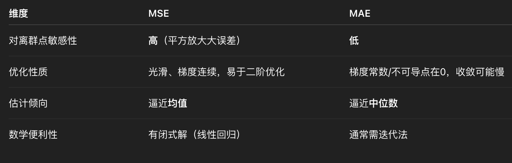

**Huber Loss / Smooth L1**
```
Huber(y, ŷ) = {
    0.5(y - ŷ)²           if |y - ŷ| ≤ δ
    δ|y - ŷ| - 0.5δ²      otherwise
}
```
- **Combines**: MSE for small errors + MAE for large errors
- **Pros**: Robust and differentiable everywhere
- **When to use**: When you want robustness to outliers but smooth gradients

**Log-Cosh Loss**
```
L(y, ŷ) = Σ log(cosh(ŷ_i - y_i))
```
- Similar to MSE but gentler on extreme errors
- Second-order differentiable
- **When to use**: Alternative to Huber with smoother gradients

#### Classification Loss Functions

**Binary Cross-Entropy Loss**
```
BCE = -[y·log(ŷ) + (1-y)·log(1-ŷ)]
```
- **When to use**: Binary classification (0/1 labels)
- Output must be probability (0 to 1)

**Categorical Cross-Entropy Loss**
```
CCE = -Σ y_i · log(ŷ_i)
```
- **When to use**: Multi-class classification (one-hot encoded labels)
- Used with softmax activation

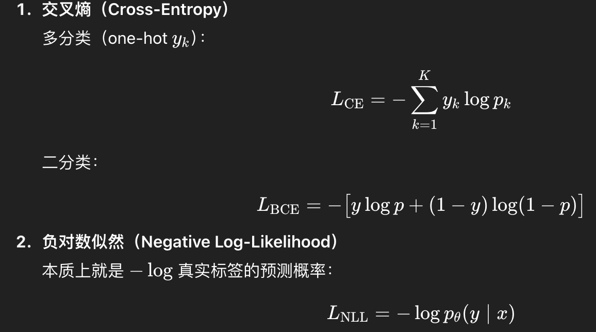

**Focal Loss**
```
FL = -α(1-p_t)^γ · log(p_t)
```
- **When to use**: Imbalanced classification
- Focuses learning on hard examples
- Parameter γ controls focus on hard examples

## 1.3 Empirical Risk vs Structural Risk

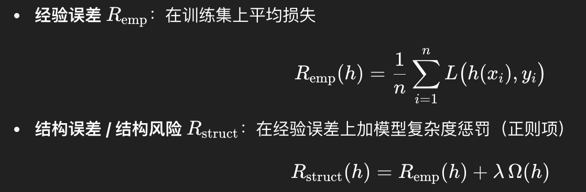

**Empirical Risk (Empirical Error)**
- Model's error on the training dataset
- "How well do I perform on problems I've seen?"
- Like: your score on practice problems

**Structural Risk**
- Empirical risk + regularization penalty for model complexity
- "Practice score + penalty for using overly complex methods"
- Prevents overfitting by penalizing complex models

**Formula**:
```
Structural Risk = Empirical Risk + λ × Complexity Penalty
```

**How to know when model is optimal?**
- Use a validation set separate from training data
- Stop when validation performance stops improving (early stopping)
- This indicates the model has learned generalizable patterns

## 1.4 Model Generalization

**Generalization Ability**: Model's performance on unseen data

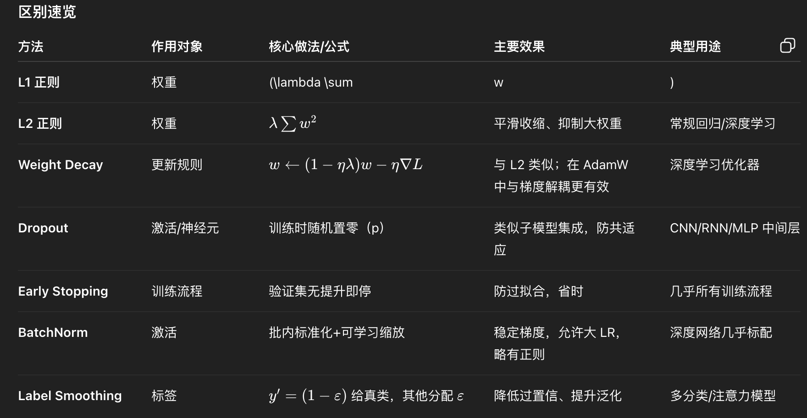

### How to Improve Generalization

**Data-Level Improvements**
- More diverse, clean data
- Data augmentation (flip, rotate, noise, mixup)
- Remove or fix label errors

**Model & Regularization**
- Reduce complexity (fewer parameters, shallower network)
- L1/L2 regularization
- Dropout
- Early stopping
- Weight decay
- Batch normalization
- Label smoothing

**Training Strategy**
- Appropriate learning rate
- Appropriate batch size
- Sufficient epochs (not too many)
- Right optimizer (Adam, SGD+momentum)
- Proper loss function

**Ensemble & Transfer**
- Bagging (Random Forest)
- Boosting (XGBoost, LightGBM)
- Transfer learning (pre-trained models)

### L2 Regularization vs Weight Decay

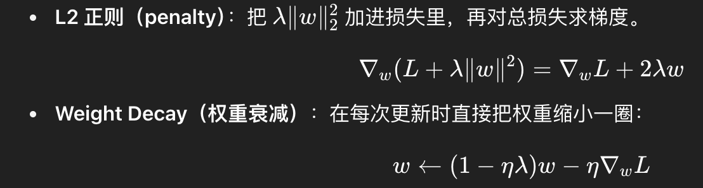

**L2 Regularization**: Adds penalty term to loss function
```
Loss_total = Loss_data + λ·Σw²
```

**Weight Decay**: Directly shrinks weights during optimization
```
w_new = w_old - lr·gradient - lr·λ·w_old
```

**Memory aid**:
- L2 adds to the loss function
- Weight Decay directly modifies the weights

### Batch Normalization & Label Smoothing

**Batch Normalization (BN)**
- Normalizes activations within each mini-batch
- Then applies learnable scale (γ) and shift (β)
- **Benefits**: Faster training, reduces internal covariate shift, mild regularization

**Label Smoothing**
- Converts hard labels (one-hot) to soft labels
- True class: 1 → 1-ε (e.g., 0.9)
- Other classes: 0 → ε/(K-1) (e.g., 0.1/9 for 10 classes)
- **Benefits**: Prevents overconfidence, improves generalization

## 1.5 Evaluation Metrics

### Classification Metrics

**Confusion Matrix Basics**:
- **TP (True Positive)**: Correctly predicted positive
- **TN (True Negative)**: Correctly predicted negative
- **FP (False Positive)**: Incorrectly predicted positive (Type I error)
- **FN (False Negative)**: Incorrectly predicted negative (Type II error)

**Accuracy**
```
Accuracy = (TP + TN) / (TP + TN + FP + FN)
```
- **Pros**: Simple, intuitive
- **Cons**: Misleading for imbalanced datasets
- **Example problem**: 99% negative samples → predicting all negative gives 99% accuracy!
- **Solution**: Use balanced accuracy or other metrics

**Precision**
```
Precision = TP / (TP + FP)
```
- "Of all predicted positives, how many are actually positive?"
- **When to optimize**: When false positives are costly (spam detection)
- **Trade-off**: Increasing precision often decreases recall

**Recall (Sensitivity, True Positive Rate)**
```
Recall = TP / (TP + FN)
```
- "Of all actual positives, how many did we find?"
- **When to optimize**: When false negatives are costly (cancer detection)
- **Trade-off**: Increasing recall often decreases precision

**F1 Score**
```
F1 = 2 · (Precision · Recall) / (Precision + Recall)
```
- Harmonic mean of precision and recall
- **When to use**: When you need balance between precision and recall
- **Variants**: F-beta score (β>1 weighs recall higher, β<1 weighs precision higher)

**Specificity (True Negative Rate)**
```
Specificity = TN / (TN + FP)
```
- "Of all actual negatives, how many did we correctly identify?"

**ROC-AUC (Receiver Operating Characteristic - Area Under Curve)**

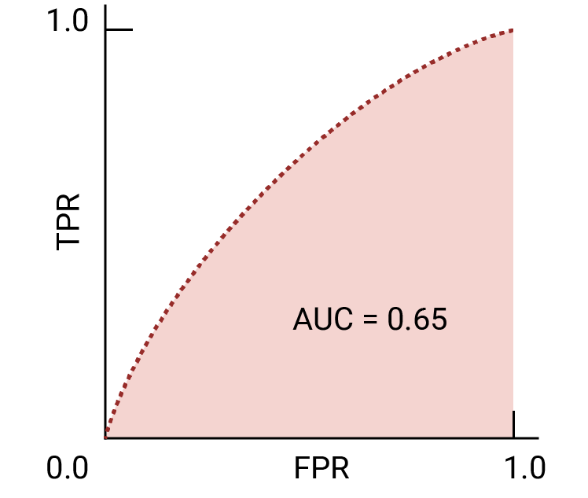

- **ROC Curve**: TPR (Recall) vs FPR at different thresholds
- **AUC**: Area under ROC curve (0 to 1)
  - 0.5: Random guessing
  - 1.0: Perfect classifier
  - 0.9-1.0: Excellent
  - 0.8-0.9: Good
  - 0.7-0.8: Fair
  - <0.7: Poor

- **When to use**: Imbalanced datasets, when you need threshold-independent metric
- **Interpretation**: Probability that model ranks random positive higher than random negative

### Regression Metrics

**Mean Squared Error (MSE)**
```
MSE = (1/n)Σ(y_i - ŷ_i)²
```

**Root Mean Squared Error (RMSE)**
```
RMSE = √MSE
```
- Same unit as target variable
- More interpretable than MSE

**Mean Absolute Error (MAE)**
```
MAE = (1/n)Σ|y_i - ŷ_i|
```
- More robust to outliers than MSE

**R² Score (Coefficient of Determination)**
```
R² = 1 - (SS_res / SS_tot)
where SS_res = Σ(y_i - ŷ_i)²
      SS_tot = Σ(y_i - ȳ)²
```
- **Range**: -∞ to 1
- **1**: Perfect predictions
- **0**: Model performs as well as mean baseline
- **<0**: Model performs worse than mean baseline

**Mean Absolute Percentage Error (MAPE)**
```
MAPE = (100/n)Σ|(y_i - ŷ_i)/y_i|
```
- **Pros**: Scale-independent, interpretable as percentage
- **Cons**: Undefined when y_i = 0, biased towards low values

## 1.6 Overfitting & Underfitting

**Underfitting (High Bias)**
- Model is too simple
- Poor performance on both training and test data
- Cannot capture underlying patterns

**Overfitting (High Variance)**
- Model is too complex
- Excellent training performance, poor test performance
- Memorizes training data including noise

**How to Detect?**
1. Compare training vs validation performance
   - Similar poor performance → Underfitting
   - Large gap (train good, val poor) → Overfitting
   - Both good → Just right

2. Learning curves
   - Plot train/val error vs training size or epochs
   - Converging curves at high error → Underfitting
   - Diverging curves → Overfitting

**Solutions for Overfitting**
- Get more training data
- Data augmentation
- Reduce model complexity
- Add regularization (L1, L2, dropout)
- Early stopping
- Ensemble methods
- Cross-validation

**Solutions for Underfitting**
- Increase model complexity
- Add more features
- Reduce regularization
- Train longer
- Use more powerful model architecture

## 1.7 Bias-Variance Tradeoff

**Bias**: Error from incorrect assumptions in the learning algorithm
- High bias → Underfitting
- Model is too simple to capture patterns

**Variance**: Error from sensitivity to fluctuations in training data
- High variance → Overfitting
- Model captures noise as if it's a pattern

**Total Error = Bias² + Variance + Irreducible Error**

**Characteristics**:
- **High Bias, Low Variance**: Consistently wrong, but predictions are similar
  - Example: Linear model for non-linear data

- **Low Bias, High Variance**: Can be right on average, but predictions vary wildly
  - Example: Deep decision tree on small dataset

**Optimization Strategies**:
- **High Bias**:
  - Use more complex model
  - Add more features
  - Reduce regularization

- **High Variance**:
  - Get more data
  - Reduce model complexity
  - Add regularization
  - Use ensemble methods (bagging reduces variance)

## 1.8 Model Selection by Use Case

Choose models based on:
1. **Data characteristics**: Size, dimensionality, feature types
2. **Problem complexity**: Linear vs non-linear
3. **Interpretability needs**: Black box vs explainable
4. **Computational resources**: Training time, inference latency
5. **Performance requirements**: Accuracy vs speed

**General Guidelines**:

| Scenario | Recommended Models |
|----------|-------------------|
| Small dataset, need interpretability | Logistic Regression, Decision Tree |
| Tabular data, high performance needed | XGBoost, LightGBM, CatBoost |
| Images | CNN (ResNet, EfficientNet, Vision Transformer) |
| Text | Transformer (BERT, GPT, T5) |
| Time series | ARIMA, LSTM, Temporal Fusion Transformer |
| Sequences | Transformer, GRU, LSTM |
| Clustering | K-Means, DBSCAN, Hierarchical |
| Large scale, sparse features | Logistic Regression with L1, FM, DeepFM |

## 1.9 Hyperparameter Optimization

Methods for finding optimal hyperparameters:

### Grid Search
- **Method**: Try all combinations in a predefined grid
- **Pros**: Thorough, guaranteed to find best in grid
- **Cons**: Exponentially expensive with more parameters
- **When to use**: Few hyperparameters, small search space

### Random Search
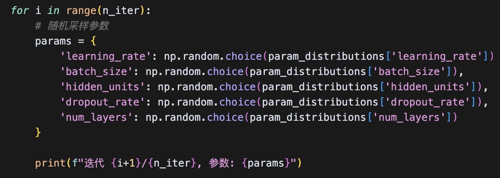
- **Method**: Sample random combinations
- **Pros**: More efficient than grid search, can find better solutions
- **Cons**: No guarantee of finding optimal
- **When to use**: Many hyperparameters, large search space

### Bayesian Optimization
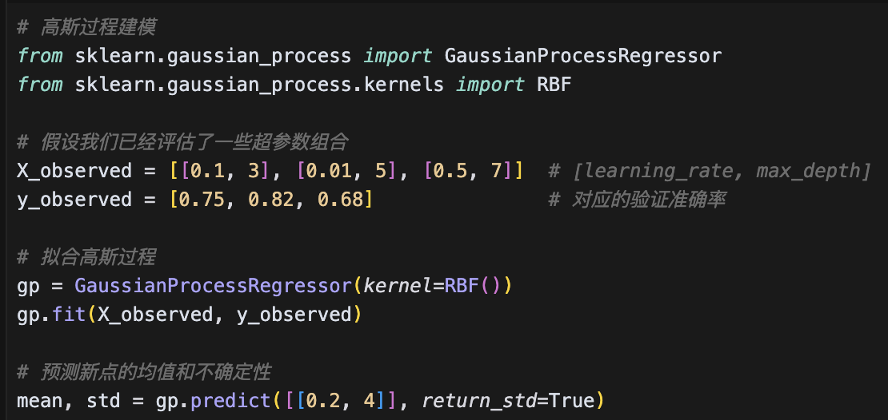
- **Method**: Build probabilistic model of objective function
- Uses past evaluations to choose next hyperparameters intelligently
- **Pros**: Very efficient, requires fewer evaluations
- **Cons**: More complex to implement
- **When to use**: Expensive evaluation (large model, long training)
- **Tools**: Optuna, Hyperopt, Ax

### Hyperband / ASHA
- **Method**: Adaptive resource allocation
- Quickly eliminates poor configurations
- **When to use**: Many configurations to try, iterative training

**Best Practices**:
1. Start with random search or Bayesian optimization
2. Use cross-validation for robust estimates
3. Search in log-scale for learning rate, regularization
4. Parallel evaluation when possible
5. Track all experiments (MLflow, Weights & Biases)

## 1.10 Error Analysis

Systematic approach to understanding model failures:

1. **Analyze Predictions**
   - Look at false positives and false negatives
   - Identify patterns in errors

2. **Segment Analysis**
   - Break down performance by subgroups
   - Example: accuracy by age group, category, etc.

3. **Feature Importance**
   - Understand which features drive predictions
   - Identify missing or weak features

4. **Data Quality**
   - Check for label errors
   - Identify distribution shift

5. **Model Diagnosis**
   - Check if model is underfitting or overfitting
   - Analyze learning curves
   - Check calibration (predicted probabilities vs actual frequencies)

6. **Iterate**
   - Collect more data for problematic segments
   - Add features to capture missing patterns
   - Adjust model architecture or hyperparameters

## 1.11 Occam's Razor Principle

**Principle**: "Among competing hypotheses, the simplest is usually correct"

**Application to ML**:
- Prefer simpler models when performance is similar
- Simpler models:
  - Easier to interpret
  - Faster to train and deploy
  - Less prone to overfitting
  - More robust to distribution shift

**Examples**:
- Start with logistic regression before trying neural networks
- Try linear model before polynomial features
- Use fewer layers/parameters if accuracy is comparable

**This aligns with**: Structural risk minimization, regularization

## 1.12 Linear vs Non-Linear Models

**Linear Models**:
- Assume linear relationship between features and target
- Examples: Linear Regression, Logistic Regression, Linear SVM
- **Pros**: Simple, interpretable, fast, work well with limited data
- **Cons**: Cannot capture complex non-linear patterns

**Non-Linear Models**:
- Can model complex, non-linear relationships
- Examples: Decision Trees, SVM with kernel, Neural Networks
- **Pros**: More expressive, better performance on complex tasks
- **Cons**: Require more data, harder to interpret, prone to overfitting

## 1.13 Generative vs Discriminative Models

**Discriminative Models**: Model P(Y|X) directly
- Learn decision boundary between classes
- Examples: Logistic Regression, SVM, Neural Networks, Random Forest
- **Pros**: Usually better performance, simpler
- **Cons**: Cannot generate new samples

**Generative Models**: Model P(X|Y) and P(Y)
- Learn how data is generated
- Examples: Naive Bayes, Hidden Markov Models, GANs, VAEs
- **Pros**: Can generate new samples, work with missing data
- **Cons**: More complex, may have stronger assumptions

## 1.14 Probabilistic vs Non-Probabilistic Models

**Probabilistic Models**: Output probabilities
- Examples: Logistic Regression, Naive Bayes, Bayesian Networks
- **Pros**: Quantify uncertainty, can use probability theory
- **Cons**: Assumptions about distributions

**Non-Probabilistic Models**: Output class labels or scores
- Examples: SVM (without Platt scaling), KNN, Decision Trees
- **Pros**: Fewer assumptions, sometimes simpler
- **Cons**: No uncertainty quantification (can be added with calibration)

## 1.15 Parametric vs Non-Parametric Models

**Parametric Models**: Fixed number of parameters
- Examples: Linear Regression, Logistic Regression, Neural Networks
- **Pros**: Fast inference, clear assumptions
- **Cons**: Limited by model structure
- **Parameters**: Determined before seeing data size

**Non-Parametric Models**: Number of parameters grows with data
- Examples: KNN, Decision Trees, Kernel SVM
- **Pros**: Flexible, can fit complex patterns
- **Cons**: Slower inference, require more data
- **Parameters**: Depends on dataset size

---

# 2. Classic Machine Learning Algorithms

## 2.1 Features & Feature Engineering

### What is a Feature?

A feature is a measurable property or characteristic of the data used to make predictions.

**Feature Types**:
- **Continuous**: Real numbers (height, temperature, price)
- **Discrete/Categorical**: Categories (color, gender, city)
- **Ordinal**: Ordered categories (rating: 1-5, education level)
- **Text**: Unstructured text (reviews, documents)
- **Temporal**: Time series (stock prices, sensor readings)

### Data Exploration & Feature Selection

**Correlation Analysis**:
- Compute correlation matrix between features
- Remove highly correlated features (multicollinearity)
- Tools: `pandas.corr()`, seaborn heatmaps

**Feature Importance**:
- Tree-based: Feature importance from Random Forest, XGBoost
- Permutation importance
- SHAP values (SHapley Additive exPlanations)

### Handling Missing Values

**When to drop features**:
- >50% missing values
- Missing pattern is not informative

**Imputation methods**:
1. **Treat as separate category**: Add "missing" as value (for categorical)
2. **Statistical imputation**:
   - Mean/median for continuous features
   - Mode for categorical features
3. **Model-based imputation**: Use Random Forest or KNN to predict missing values
4. **Forward/backward fill**: For time series

### Numerical Feature Processing

**Why normalize/standardize?**
- Eliminates scale differences between features
- Faster convergence in gradient descent
- Required for distance-based algorithms (KNN, SVM)

**Normalization Methods**:

**Min-Max Scaling**:
```
x' = (x - x_min) / (x_max - x_min)
```
- **Pros**: Bounded [0,1], preserves zero values
- **Cons**: Sensitive to outliers
- **When to use**: Neural networks, algorithms requiring bounded input

**Z-Score Standardization**:
```
x' = (x - μ) / σ
```
- **Pros**: Not sensitive to outliers, works with normal distributions
- **Cons**: Not bounded, can produce negative values
- **When to use**: Logistic regression, SVM, PCA

**Robust Scaling**:
```
x' = (x - median) / IQR
```
- **Pros**: Very robust to outliers
- **When to use**: Data with many outliers

### Categorical Feature Encoding

**One-Hot Encoding**:
```python
['red', 'blue', 'green'] →
[[1,0,0], [0,1,0], [0,0,1]]
```
- **Pros**: No ordinal assumption
- **Cons**: High dimensionality for high-cardinality features (curse of dimensionality)
- **When to use**: Low-cardinality features (<10 unique values)

**Label Encoding**:
```python
['red', 'blue', 'green'] → [0, 1, 2]
```
- **Pros**: Compact
- **Cons**: Implies ordering (not suitable for nominal categories)
- **When to use**: Ordinal features, tree-based models

**Feature Embedding**:
```python
10 cities → 4-dimensional vectors
```
- **Pros**: Reduces dimensionality dramatically, learns semantic relationships
- **Cons**: Requires training
- **When to use**: High-cardinality features (>50 unique values), neural networks
- **Example**: City with 1000 values → 10-20 dimensional embedding

### Sequence Data Processing

**Bag of Words (BoW)**:
1. Tokenize text into words
2. Remove stop words
3. Count word frequencies
4. Create feature vector

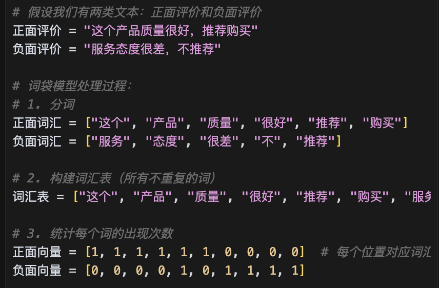

- **Pros**: Simple, interpretable
- **Cons**: Loses word order, ignores semantics
- **When to use**: Simple text classification, small vocabulary

**Word Embeddings**:
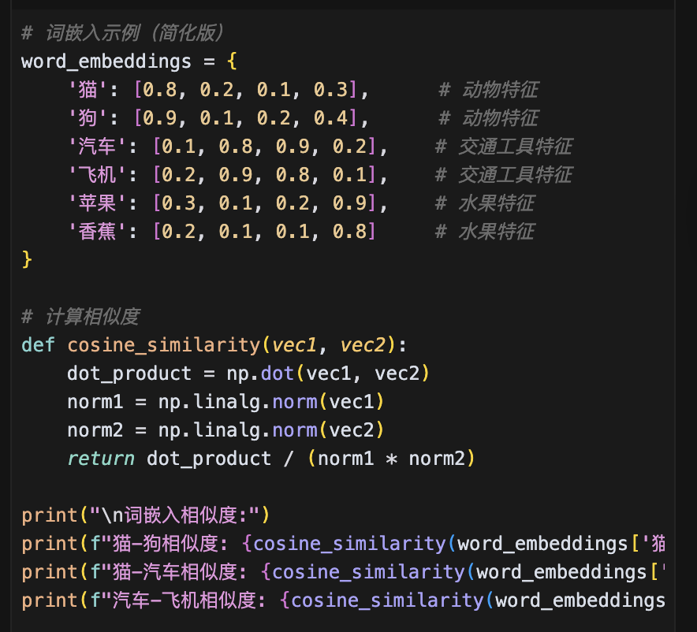

Maps words to dense vectors where similar words are close in vector space.

**Word2Vec**:
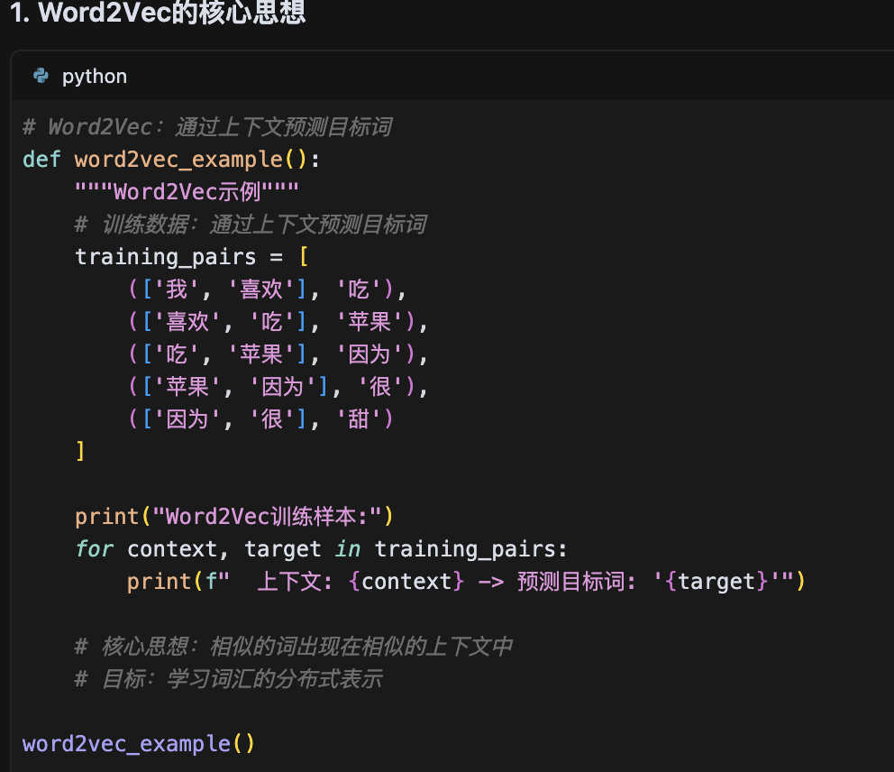
- Two architectures: CBOW (predicts word from context) and Skip-gram (predicts context from word)
- **Pros**: Captures semantic similarity
- **When to use**: Text with rich vocabulary

**TF-IDF (Term Frequency-Inverse Document Frequency)**:
```
TF-IDF(word, doc) = TF(word, doc) × IDF(word)
where IDF(word) = log(N / df(word))
```
- **Pros**: Downweights common words
- **When to use**: Document classification, search

### Word2Vec vs LDA

**Word2Vec**: Word embeddings (distributed representations)
- Unsupervised learning of word vectors
- Captures word-level semantics


**LDA (Latent Dirichlet Allocation)**: Topic modeling
- Discovers topics in document collection
- Document is mixture of topics

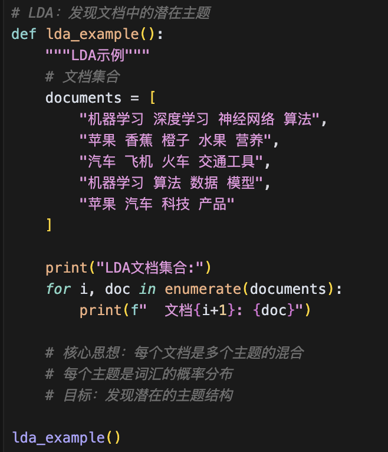

## 2.2 Linear & Logistic Regression

### Linear Regression

**Model**: y = wx + b
- Predicts continuous output
- Assumes linear relationship

**Loss**: MSE
**Optimization**: Closed-form solution or gradient descent

**Assumptions**:
1. Linearity
2. Independence of errors
3. Homoscedasticity (constant variance)
4. Normal distribution of errors

### Logistic Regression

**Model**: P(y=1|x) = σ(wx + b) where σ(z) = 1/(1+e^(-z))
- Predicts probability between 0 and 1
- Uses sigmoid activation

**Loss**: Binary cross-entropy
**Optimization**: Gradient descent

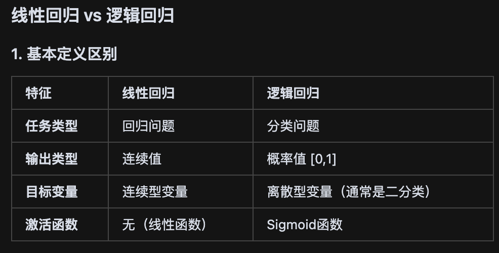

**Key Differences**:
| Aspect | Linear Regression | Logistic Regression |
|--------|------------------|---------------------|
| Output | Continuous | Probability (0-1) |
| Use case | Regression | Classification |
| Loss | MSE | Cross-entropy |
| Assumptions | Linear relationship | Linear decision boundary |

## 2.3 Support Vector Machines (SVM)

### Core Idea

Find the hyperplane that maximizes the margin between classes.

**Objective**:
```
Maximize: margin = 2 / ||w||
Subject to: y_i(w·x_i + b) ≥ 1 for all i
```

**Key Concepts**:
- **Support Vectors**: Data points closest to decision boundary
- **Margin**: Distance between boundary and closest points
- **Soft Margin**: Allow some misclassification with penalty (parameter C)

### Kernel Trick

Transform data to higher dimension where it becomes linearly separable.

**Common Kernels**:

1. **Linear**: K(x,y) = x·y
   - When to use: Data is linearly separable, high-dimensional features

2. **Polynomial**: K(x,y) = (x·y + c)^d
   - When to use: Polynomial decision boundaries

3. **RBF (Radial Basis Function)**: K(x,y) = exp(-γ||x-y||²)
   - When to use: Default choice, non-linear patterns, small-medium datasets
   - **Parameter γ**: Controls flexibility (high γ = more complex)

4. **Sigmoid**: K(x,y) = tanh(αx·y + c)
   - When to use: Neural network-like behavior

### SVM Characteristics

- **Linear or Non-linear**: Linear with linear kernel, non-linear with other kernels
- **Sensitive to missing values**: Yes, must impute first
- **Sensitive to scale**: Yes, must normalize features
- **Support vectors**: Fewer is better (more efficient, less overfitting)

## 2.4 Naive Bayes

### Bayes' Theorem

```
P(Y|X) = P(X|Y) · P(Y) / P(X)
```

- P(Y|X): Posterior probability
- P(X|Y): Likelihood
- P(Y): Prior probability
- P(X): Evidence (marginal probability)

### Naive Bayes Assumption

Features are conditionally independent given the class:
```
P(X|Y) = P(x₁|Y) · P(x₂|Y) · ... · P(xₙ|Y)
```

**"Naive" because**: This independence assumption is rarely true in practice
- **Problem**: Features are often correlated
- **Despite this**: Often works well in practice!

### Types of Naive Bayes

1. **Gaussian NB**: Continuous features (assumes Gaussian distribution)
2. **Multinomial NB**: Count features (text classification with word counts)
3. **Bernoulli NB**: Binary features

### Advantages & Limitations

**Pros**:
- Fast training and prediction
- Works well with small datasets
- Handles high-dimensional data
- Good for text classification

**Cons**:
- Independence assumption is often wrong
- Poor performance when features are correlated
- Cannot learn feature interactions

## 2.5 Decision Trees

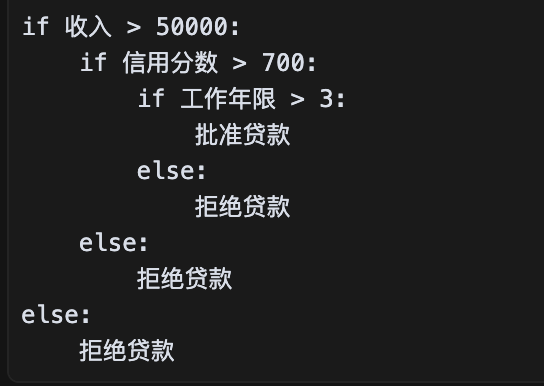

### Building a Decision Tree

**Algorithm** (Recursive splitting):
1. Select best feature to split on
2. Split data based on that feature
3. Repeat for each subset until stopping criterion

**Splitting Criteria**:

**Entropy** (measure of uncertainty):
```
H(S) = -Σ p_i·log₂(p_i)
```
- 0: Pure (all same class)
- 1: Maximum uncertainty (50-50 split for binary)

**Information Gain**:
```
IG(S, A) = H(S) - Σ |S_v|/|S| · H(S_v)
```
- How much uncertainty is reduced by splitting on feature A
- **Used by**: ID3 algorithm

**Information Gain Ratio**:
```
GR(S, A) = IG(S, A) / H(A)
```
- Normalizes by entropy of attribute
- **Used by**: C4.5 algorithm
- **Advantage**: Reduces bias towards high-cardinality features

**Gini Impurity**:
```
Gini(S) = 1 - Σ p_i²
```
- 0: Pure
- 0.5: Maximum impurity (binary)
- **Used by**: CART algorithm
- **Advantage**: Faster to compute than entropy

### Decision Tree Algorithms

| Algorithm | Splitting Criterion | Features | Output |
|-----------|-------------------|----------|--------|
| **ID3** | Information Gain | Categorical only | Classification |
| **C4.5** | Gain Ratio | Categorical + Numerical | Classification |
| **CART** | Gini Impurity | All types | Classification & Regression |

### Preventing Overfitting: Tree Pruning

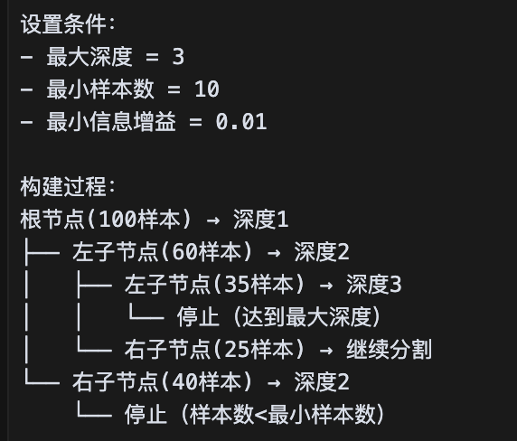

**Pre-Pruning** (Early Stopping):
- Stop growing when:
  - Max depth reached
  - Min samples per leaf reached
  - Information gain < threshold

**Post-Pruning**:
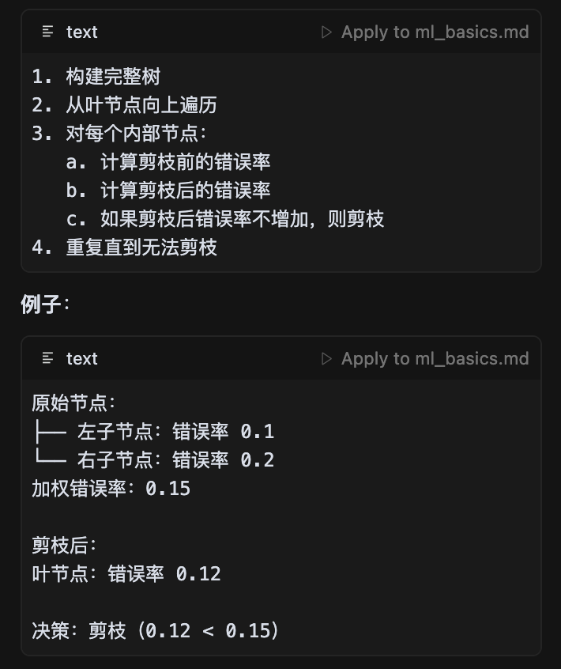
- Grow full tree
- Remove branches that don't improve validation performance
- **Methods**: Reduced error pruning, cost-complexity pruning

**Hyperparameters**:
- `max_depth`: Maximum tree depth
- `min_samples_split`: Minimum samples to split node
- `min_samples_leaf`: Minimum samples in leaf
- `max_features`: Number of features to consider for split

## 2.6 Random Forest

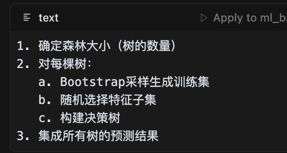

### Core Idea

Ensemble of decision trees trained on random subsets of data and features.

**Algorithm**:
1. Bootstrap sampling: Create N random subsets with replacement
2. Train decision tree on each subset
   - At each split, consider random subset of features (√p for classification, p/3 for regression)
3. Aggregate predictions:
   - Classification: Majority vote
   - Regression: Average

### "Random" Components

1. **Row Sampling (Bagging)**: Each tree sees different subset of data
2. **Feature Sampling**: Each split considers random subset of features
3. **Random Splits** (Extra Trees variant): Split thresholds chosen randomly

### Handling Missing Values

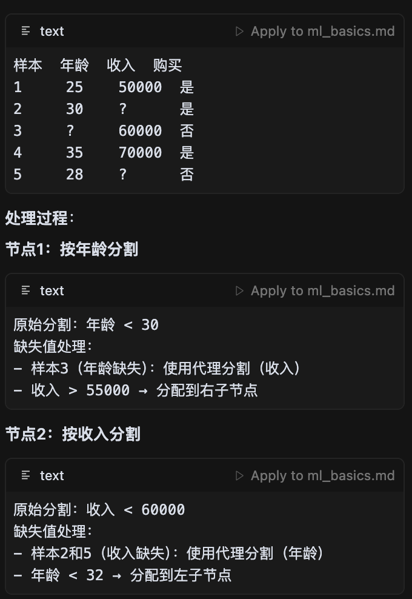

**Methods**:
1. **Proximity-based imputation**: Use leaf node proximity to find similar samples
2. **Split into categories**: Treat missing as separate category
3. **Iterative imputation**: Use RF to predict missing values

### Feature Importance

**Methods**:
1. **Mean Decrease Impurity**: Average Gini/entropy reduction from feature
2. **Mean Decrease Accuracy**: Drop in accuracy when feature is permuted

### Advantages & Limitations

**Pros**:
- Reduces overfitting compared to single tree
- Handles non-linear relationships
- Robust to outliers
- No need for feature scaling
- Can handle missing values
- Provides feature importance

**Cons**:
- Less interpretable than single tree
- Slower training and inference than single tree
- Memory intensive (stores multiple trees)
- Can overfit on noisy datasets

**Why better than single tree?**
- Reduces variance through averaging (bagging)
- Feature randomness decorrelates trees
- Ensemble wisdom: Diverse trees make fewer correlated errors

### Can we use other base models?

**No, not typically**:
- **Linear models**: No benefit from bagging (averaging linear models = linear model)
- **KNN**: Computationally expensive, doesn't benefit much
- **Trees are ideal**: High variance, low bias → perfect for bagging

## 2.7 K-Nearest Neighbors (KNN)

### Algorithm

**Training**: Store all training data (lazy learning)
**Prediction**:
1. Find K nearest neighbors to query point
2. Classification: Majority vote
3. Regression: Average of neighbors

**Distance Metrics**:
- Euclidean: √Σ(x_i - y_i)²
- Manhattan: Σ|x_i - y_i|
- Minkowski: (Σ|x_i - y_i|^p)^(1/p)
- Cosine: 1 - (x·y)/(||x||·||y||)

**Choosing K**:
- K too small: Sensitive to noise, overfitting
- K too large: Underfitting, blurred boundaries
- Typical: K = √n (odd number to avoid ties)
- Use cross-validation to find optimal K

**Characteristics**:
- **Non-parametric**: No training phase
- **Lazy learning**: All computation at prediction time
- **Sensitive to outliers**: Yes
- **Requires feature scaling**: Yes, very important!

## 2.8 Gradient Boosting Decision Trees (GBDT)

### Core Idea

**Boosting**: Build trees sequentially, each correcting errors of previous trees

**Algorithm**:
1. Start with initial prediction (e.g., mean)
2. For each iteration:
   - Compute residuals (errors) from current prediction
   - Train tree to predict residuals
   - Add tree to ensemble with learning rate
3. Final prediction = sum of all trees

**Pseudocode**:
```
F₀(x) = initial_value
For m = 1 to M:
    residuals = y - F_{m-1}(x)
    h_m(x) = DecisionTree(X, residuals)
    F_m(x) = F_{m-1}(x) + lr × h_m(x)
```

### Gradient Boosting vs Gradient Descent

**Gradient Descent**: Optimize parameters in parameter space
- Update: w ← w - lr × ∂L/∂w

**Gradient Boosting**: Optimize predictions in function space
- Add: F_m ← F_{m-1} + lr × h_m(x)
- h_m approximates negative gradient of loss

**Similarity**: Both follow negative gradient direction
**Difference**: GD updates parameters, GB adds functions

### Boosting vs Bagging

| Aspect | Bagging (RF) | Boosting (GBDT) |
|--------|-------------|-----------------|
| **Training** | Parallel | Sequential |
| **Sampling** | Bootstrap with replacement | All data, weighted |
| **Trees** | Deep, uncorrelated | Shallow, correlated |
| **Goal** | Reduce variance | Reduce bias |
| **Speed** | Faster (parallel) | Slower (sequential) |
| **Overfitting** | Less prone | More prone |

### GBDT vs XGBoost

**XGBoost Improvements**:
1. **Regularization**: L1/L2 on leaf weights
2. **Tree pruning**: Max depth with pruning
3. **Missing values**: Learns optimal direction for missing values
4. **Parallel processing**: Feature-level parallelization
5. **Cache optimization**: Better memory access patterns
6. **Sparsity awareness**: Efficient sparse matrix handling

**When to use**:
- **GBDT**: Baseline, simpler problems
- **XGBoost**: Competitions, large datasets, need speed
- **LightGBM**: Very large datasets, faster than XGBoost
- **CatBoost**: Categorical features, less tuning needed

### Preventing Overfitting in GBDT

**Techniques**:
1. **Learning rate (shrinkage)**: Smaller lr + more trees
2. **Max depth**: Keep trees shallow (3-6)
3. **Min samples per leaf**: Prevent tiny leaves
4. **Subsample**: Use fraction of data per tree (0.5-0.8)
5. **Feature sampling**: Use subset of features (like RF)
6. **Early stopping**: Monitor validation loss
7. **Regularization**: L1/L2 penalties (XGBoost)

**Key Hyperparameters**:
- `n_estimators`: Number of trees (more is better, with small lr)
- `learning_rate`: Shrinkage (0.01-0.3, smaller = better but slower)
- `max_depth`: Tree depth (3-10)
- `min_child_weight`: Minimum samples per leaf
- `subsample`: Row sampling fraction
- `colsample_bytree`: Feature sampling fraction

## 2.9 K-Means Clustering

### Algorithm

1. Initialize K cluster centers (randomly or K-means++)
2. Repeat until convergence:
   - **Assignment**: Assign each point to nearest center
   - **Update**: Recompute centers as mean of assigned points

### Loss Function

**Objective**: Minimize within-cluster sum of squares (WCSS)
```
J = Σ Σ ||x_i - μ_k||²
    k  x_i∈C_k
```

### Choosing K

**Methods**:
1. **Elbow method**: Plot WCSS vs K, look for "elbow"
2. **Silhouette score**: Measure cluster quality [-1, 1]
3. **Gap statistic**: Compare to random data
4. **Domain knowledge**: Use business logic

### Initialization: K-means++

**Problem**: Random initialization can lead to poor local minimum

**K-means++ solution**:
1. Choose first center randomly
2. For remaining centers:
   - Choose next center with probability proportional to distance² from existing centers
   - Farther points are more likely to be chosen
3. Run standard K-means

**Benefit**: Better initial centers → faster convergence, better results

### Improving Efficiency

1. **Mini-batch K-means**: Use random batches instead of full data
2. **Elkan's algorithm**: Use triangle inequality to avoid distance computations
3. **Parallelization**: Distribute distance computations
4. **Dimensionality reduction**: PCA before clustering

### Distance Metrics

| Metric | Formula | When to Use |
|--------|---------|-------------|
| **Euclidean** | √Σ(x_i-y_i)² | Continuous features, spherical clusters |
| **Manhattan** | Σ\|x_i-y_i\| | Grid-like data, robust to outliers |
| **Cosine** | 1 - x·y/(\\|x\\|\\|y\\|) | Text, high-dimensional sparse data |
| **Hamming** | # different bits | Binary/categorical features |

### Sensitivity & Evaluation

**Sensitive to**:
- Outliers: Yes, they pull centers
- Scale: Yes, must normalize features
- Initialization: Yes, use K-means++
- K choice: Yes, critical hyperparameter

**Evaluation Metrics** (Unsupervised):
- **Silhouette Score**: How well-separated clusters are
  - +1: Perfect clustering
  - 0: Overlapping clusters
  - -1: Wrong clustering

- **Davies-Bouldin Index**: Average similarity between clusters (lower is better)
- **Calinski-Harabasz Index**: Ratio of between-cluster to within-cluster variance (higher is better)

**If labels available**:
- Adjusted Rand Index (ARI)
- Normalized Mutual Information (NMI)

### Limitations & Alternatives

**K-Means Limitations**:
- Assumes spherical clusters
- Sensitive to outliers and scale
- Must specify K in advance
- Cannot handle non-convex shapes

**Alternatives**:

1. **DBSCAN (Density-Based)**
   - Finds arbitrary-shaped clusters
   - Robust to outliers
   - Doesn't require K
   - **When to use**: Noise present, non-spherical clusters

2. **Hierarchical Clustering**
   - Creates dendrogram of nested clusters
   - No need to specify K upfront
   - **When to use**: Want cluster hierarchy, small datasets

3. **Gaussian Mixture Models (GMM)**
   - Soft clustering (probabilistic)
   - Can model elliptical clusters
   - **When to use**: Need uncertainty, clusters have different shapes/sizes

---

# 3. Deep Learning

## 3.1 Deep Neural Networks (DNN)

### Neural Network Structure

**Neuron/Node**:
```
output = activation(Σ w_i·x_i + b)
```

**Network Layers**:
- **Input layer**: Raw features
- **Hidden layers**: Learn representations
- **Output layer**: Final prediction

**Activation Functions**:

| Function | Formula | Range | Use Case |
|----------|---------|-------|----------|
| **Sigmoid** | 1/(1+e^(-x)) | (0, 1) | Binary classification output |
| **Tanh** | (e^x - e^(-x))/(e^x + e^(-x)) | (-1, 1) | Hidden layers (zero-centered) |
| **ReLU** | max(0, x) | [0, ∞) | Default for hidden layers |
| **Leaky ReLU** | max(0.01x, x) | (-∞, ∞) | Prevents dying ReLU |
| **Softmax** | e^(x_i)/Σe^(x_j) | (0, 1), Σ=1 | Multi-class classification |

### Forward Propagation

Pass input through network layer by layer:
```
Layer 1: a₁ = σ(W₁·x + b₁)
Layer 2: a₂ = σ(W₂·a₁ + b₂)
...
Output: ŷ = σ(Wₙ·aₙ₋₁ + bₙ)
```

### Backpropagation

**Goal**: Compute gradients of loss with respect to all parameters

**Chain Rule**:
```
∂L/∂W^(l) = ∂L/∂a^(l) · ∂a^(l)/∂z^(l) · ∂z^(l)/∂W^(l)
```

**Algorithm**:
1. Forward pass: Compute outputs and cache activations
2. Compute loss
3. Backward pass: Compute gradients layer by layer (reverse order)
4. Update weights: W ← W - lr × ∂L/∂W

**Optimization Algorithms**:

1. **SGD (Stochastic Gradient Descent)**
   ```
   W ← W - lr × ∂L/∂W
   ```
   - Simple, but slow convergence

2. **SGD with Momentum**
   ```
   v ← β·v + ∂L/∂W
   W ← W - lr·v
   ```
   - Accelerates in relevant directions

3. **Adam (Adaptive Moment Estimation)**
   ```
   m ← β₁·m + (1-β₁)·∂L/∂W         # First moment
   v ← β₂·v + (1-β₂)·(∂L/∂W)²      # Second moment
   W ← W - lr·m/√(v + ε)
   ```
   - Adaptive learning rates per parameter
   - **Default choice** for most problems

### Dropout

**Mechanism**: During training, randomly set neuron outputs to 0 with probability p

**Purpose**:
- Prevents co-adaptation of neurons
- Forces network to learn redundant representations
- Ensemble effect (training many sub-networks)

**Implementation**:
- **Training**: Drop with probability p, scale by 1/(1-p)
- **Inference**: Use all neurons (no dropout)

**Typical values**: p = 0.5 for hidden layers, 0.1-0.2 for input layer

### Gradient Vanishing & Exploding

**Vanishing Gradients**:
- **Cause**:
  - Activation derivatives too small (sigmoid, tanh)
  - Deep networks: gradients multiply through layers
- **Result**: Early layers learn very slowly
- **Solutions**:
  - Use ReLU activation
  - Batch normalization
  - Residual connections (ResNet)
  - Better weight initialization (Xavier, He)

**Exploding Gradients**:
- **Cause**: Large weight initialization, deep networks
- **Result**: Unstable training, NaN values
- **Solutions**:
  - Gradient clipping: clip |gradient| to threshold
  - L2 regularization
  - Better weight initialization

### When to Use Deep vs Shallow Networks?

**Shallow Networks** (1-2 hidden layers):
- Small datasets (<10K samples)
- Simple patterns (linear or mildly non-linear)
- Limited compute resources
- Need fast inference

**Deep Networks** (3+ hidden layers):
- Large datasets (>100K samples)
- Complex hierarchical patterns (images, text, audio)
- End-to-end learning (minimize feature engineering)
- Sufficient compute available

### Activation Function Comparison

**Sigmoid**:
- **Pros**: Smooth, interpretable as probability
- **Cons**: Vanishing gradients, not zero-centered, slow

**Tanh**:
- **Pros**: Zero-centered, stronger gradients than sigmoid
- **Cons**: Still suffers from vanishing gradients

**ReLU**:
- **Pros**: No vanishing gradient, fast computation, sparsity
- **Cons**: Dying ReLU (neurons can "die" if always negative)

**Leaky ReLU / PReLU**:
- **Pros**: Solves dying ReLU problem
- **Cons**: Extra hyperparameter (slope)

**Best practices**:
- Hidden layers: ReLU or Leaky ReLU
- Output: Sigmoid (binary), Softmax (multi-class), Linear (regression)

### Weight Initialization

**Why not all zeros?**
- All neurons compute same function
- Symmetry prevents learning
- **Never initialize weights to same value**

**Methods**:

**Xavier/Glorot Initialization** (for sigmoid, tanh):
```
W ~ Uniform(-√(6/(n_in + n_out)), √(6/(n_in + n_out)))
```

**He Initialization** (for ReLU):
```
W ~ Normal(0, √(2/n_in))
```

**Purpose**: Keep variance of activations constant across layers

### Batch Size Effects

**Small Batch Size** (1-32):
- **Pros**:
  - More stochastic → better generalization
  - Requires less memory
  - Can escape sharp local minima
- **Cons**:
  - Slower convergence
  - Noisy gradients
  - Slower per-epoch (more updates)

**Large Batch Size** (256-1024):
- **Pros**:
  - More stable gradients
  - Better hardware utilization
  - Faster per-epoch (fewer updates)
- **Cons**:
  - Requires more memory
  - May converge to sharp minima (poor generalization)
  - Requires larger learning rate

**Best practices**:
- Start with 32-64, increase if memory allows
- Use learning rate warmup for large batches
- Monitor both train and validation metrics

## 3.2 Convolutional Neural Networks (CNN)

### CNN Architecture

**Typical layers**:
1. **Convolutional Layer**: Extract features
2. **Activation**: Non-linearity (ReLU)
3. **Pooling**: Downsample
4. **Flatten**: Convert to 1D
5. **Fully Connected**: Classification

### Convolutional Layer

**Operation**: Slide filter/kernel over input, compute dot product

```
Output[i,j] = Σ Σ Input[i+m, j+n] × Kernel[m,n]
              m n
```

**Parameters**:
- **Kernel size**: 3×3, 5×5 (smaller = more layers needed)
- **Stride**: How much to move filter (1, 2)
- **Padding**: Add borders (same/valid)
- **Number of filters**: Depth of output

**Why convolution?**
1. **Local connectivity**: Each neuron connects to small region
2. **Parameter sharing**: Same filter applied everywhere
3. **Translation invariance**: Detects pattern anywhere in image

### Convolutional Kernel Design

**Small kernels (3×3)** - Modern preference:
- **Pros**:
  - More layers for same receptive field
  - More non-linearity
  - Fewer parameters
- **Cons**: More layers needed for large receptive field
- **When to use**: Most modern architectures (ResNet, VGG)

**Large kernels (7×7, 11×11)** - Legacy:
- **Pros**: Larger receptive field immediately
- **Cons**: Many parameters, less expressive
- **When to use**: Rarely (maybe first layer for large images)

**1×1 kernels**:
- **Purpose**:
  - Dimensionality reduction
  - Add non-linearity without changing spatial size
  - Cross-channel information mixing
- **When to use**: Inception modules, bottleneck layers

**Receptive field**:
```
Two 3×3 layers = 5×5 receptive field
Three 3×3 layers = 7×7 receptive field
```

### Translation Invariance

**Property**: CNN detects same feature regardless of position

**Why?**
- Parameter sharing: Same filter applied everywhere
- Pooling: Aggregates nearby features

**Benefit**: Learns generalizable features, not position-specific

### Pooling Layers

**Max Pooling**: Take maximum in each window
- **Pros**: Strongest feature, translation invariance
- **Common**: 2×2 window, stride 2

**Average Pooling**: Take average in each window
- **Pros**: Smoother, less information loss
- **When to use**: End of network (global average pooling)

**Why pooling?**
1. Reduce spatial dimensions → fewer parameters
2. Increase receptive field
3. Provide translation invariance
4. Prevent overfitting

### Batch Normalization in CNN

**Operation**: Normalize activations across batch dimension
```
x_norm = (x - μ_batch) / √(σ²_batch + ε)
x_out = γ·x_norm + β    # Learnable scale and shift
```

**Benefits**:
1. Faster training (higher learning rates)
2. Reduces internal covariate shift
3. Acts as regularization
4. Less sensitive to weight initialization

**Where to place**: After convolution, before activation (or after, debated)

### Sparse Connectivity & Parameter Sharing

**Sparse Connectivity**:
- Each output neuron connects to small region of input (local receptive field)
- vs Fully connected: Every output connects to every input
- **Benefit**: Fewer parameters, captures local patterns

**Parameter Sharing**:
- Same filter weights used across entire image
- vs Individual weights for each location
- **Benefit**: Dramatically fewer parameters, translation invariance

**Example**:
- Input: 224×224×3 image
- Fully connected to 1000 features: 224×224×3×1000 = 150M parameters
- Conv layer (3×3, 64 filters): 3×3×3×64 = 1,728 parameters
- **Reduction**: ~100,000×

### Fine-Tuning Pre-trained Models

**Transfer Learning Strategy**:

1. **Feature Extraction** (Frozen base):
   - Freeze all pre-trained layers
   - Only train new classification head
   - **When**: Very small dataset, very different task

2. **Fine-Tuning** (Partial unfreezing):
   - Freeze early layers
   - Unfreeze and train later layers
   - **When**: Medium dataset, somewhat similar task

3. **Full Fine-Tuning**:
   - Unfreeze all layers
   - Train entire network with small learning rate
   - **When**: Large dataset, similar domain

**Best Practices**:
- Use smaller learning rate for pre-trained layers (1/10 of new layer lr)
- Gradually unfreeze from top to bottom
- Use different learning rates per layer group (discriminative fine-tuning)
- Monitor validation performance carefully

**When to use**:
- **Always start with pre-trained model** if available (ImageNet for images)
- Only train from scratch if:
  - No pre-trained model exists for your domain
  - Your images are very different (medical, satellite, etc. - but still try!)
  - You have millions of labeled samples

## 3.3 Recurrent Neural Networks (RNN)

### RNN Architecture

**Key idea**: Maintain hidden state that captures sequence history

**Recurrence relation**:
```
h_t = f(W_hh·h_{t-1} + W_xh·x_t + b_h)
y_t = g(W_hy·h_t + b_y)
```

**Components**:
- x_t: Input at time step t
- h_t: Hidden state (memory) at time t
- y_t: Output at time step t
- W_hh, W_xh, W_hy: Weight matrices (shared across time)

### RNN vs DNN

| Aspect | DNN | RNN |
|--------|-----|-----|
| **Structure** | Feedforward | Recurrent (loops) |
| **Memory** | None | Hidden state memory |
| **Parameters** | Different per layer | Shared across time |
| **Input** | Fixed size | Variable length sequences |
| **Use cases** | Images, tabular data | Text, time series, speech |

### Why RNN Has Memory

**Recurrent connection**: h_t depends on h_{t-1}
- h_{t-1} encodes information from all previous time steps
- **Unrolled view**: RNN is deep network sharing weights across time

**Memory mechanism**:
```
h_0 → h_1 → h_2 → h_3 → ...
  ↓     ↓     ↓     ↓
  y_0   y_1   y_2   y_3
```

### RNN Variants

**Problems with vanilla RNN**:
- Vanishing gradients → cannot capture long-term dependencies
- Exploding gradients → unstable training

**LSTM (Long Short-Term Memory)**:
- **Gates**: Input, forget, output gates
- **Cell state**: Separate from hidden state
- **Benefit**: Can learn long-range dependencies (100+ steps)

**GRU (Gated Recurrent Unit)**:
- **Simpler than LSTM**: Fewer gates (reset, update)
- **Faster**: Fewer parameters
- **Performance**: Similar to LSTM on many tasks

**When to use**:
- **LSTM**: Default choice, complex long-term dependencies
- **GRU**: Faster training, similar performance to LSTM
- **Vanilla RNN**: Rarely (only very short sequences)

### Applications

RNN suitable for:
- **Sequence-to-sequence**: Translation, summarization
- **Sequence-to-label**: Sentiment analysis, text classification
- **Sequence-to-sequence (same length)**: Named entity recognition, POS tagging
- **Time series**: Forecasting, anomaly detection

## 3.4 Transformers

### Core Innovation: Self-Attention

**Problem with RNN**:
- Sequential processing (cannot parallelize)
- Long-range dependencies are difficult
- Gradient issues

**Transformer solution**:
- Process entire sequence in parallel
- Direct connections between all positions
- Attention mechanism to focus on relevant parts

### Self-Attention Mechanism

**Intuition**: When understanding a word, attend to relevant context words

**Example**: "The animal didn't cross the street because **it** was too tired"
- "it" refers to "animal" (not "street")
- Self-attention learns to attend to "animal" when processing "it"

**Mathematical formulation**:
```
Attention(Q, K, V) = softmax(QK^T / √d_k) V
```

**Components**:
- **Q (Query)**: "What am I looking for?"
- **K (Key)**: "What can I provide?"
- **V (Value)**: "What information do I contain?"
- **QK^T**: Compute relevance scores between all pairs
- **√d_k**: Scaling factor (prevents large dot products)
- **softmax**: Convert to probability distribution
- **V**: Weight values by attention scores

### Why Better Than RNN/CNN?

**vs RNN**:
| Aspect | RNN | Self-Attention |
|--------|-----|---------------|
| **Parallelization** | ❌ Sequential | ✅ Fully parallel |
| **Long-range** | ❌ Gradient vanishing | ✅ Direct connections |
| **Training speed** | ❌ Slow | ✅ Fast |

**vs CNN**:
| Aspect | CNN | Self-Attention |
|--------|-----|---------------|
| **Receptive field** | ❌ Local (needs many layers) | ✅ Global (single layer) |
| **Position info** | ❌ Complex | ✅ Position encodings |
| **Interpretability** | ❌ Hard to visualize | ✅ Attention weights |

### Multi-Head Attention

**Idea**: Multiple attention mechanisms in parallel

**Why?**
- Different heads can attend to different aspects
- Example: One head for syntax, another for semantics

**Formula**:
```
MultiHead(Q,K,V) = Concat(head₁, ..., headₕ)W^O
where head_i = Attention(QW_i^Q, KW_i^K, VW_i^V)
```

**Typical**: 8-16 heads

### Transformer Architecture

**Encoder**:
```
Input → Embedding + Positional Encoding
  → Multi-Head Self-Attention
  → Add & Norm
  → Feed-Forward Network
  → Add & Norm
  → [Repeat N times]
```

**Decoder** (for sequence-to-sequence):
```
Output → Embedding + Positional Encoding
  → Masked Multi-Head Self-Attention
  → Add & Norm
  → Cross-Attention (with encoder output)
  → Add & Norm
  → Feed-Forward Network
  → Add & Norm
  → [Repeat N times]
```

**Key components**:
- **Positional Encoding**: Inject position information (sine/cosine functions)
- **Add & Norm**: Residual connection + layer normalization
- **Feed-Forward**: Two-layer MLP (expands then contracts)

### Applications

**NLP**:
- BERT: Pre-training with masked language modeling
- GPT: Autoregressive language generation
- T5: Text-to-text framework

**Beyond NLP**:
- Vision Transformers (ViT): Image classification
- DALL-E: Text-to-image generation
- AlphaFold: Protein structure prediction

### Seq2Seq

**Task**: Map input sequence to output sequence (possibly different lengths)

**Examples**:
- Machine translation: English → French
- Summarization: Long text → Short summary
- Question answering: Question + Context → Answer

**Classic Architecture** (with attention):
```
Encoder: Input → RNN/Transformer → Context representation
Decoder: Context + previous outputs → RNN/Transformer → Next output
Attention: Decoder attends to relevant encoder positions
```

**Modern approach**: Transformer encoder-decoder

---

# 4. Practical Applications

*Note: This section can be populated with your specific project experiences while keeping them generalized for public sharing.*

## Example Project Categories

### 4.1 Recommendation Systems
- Collaborative filtering
- Content-based filtering
- Hybrid approaches
- Evaluation metrics (NDCG, MRR, Recall@K)

### 4.2 Predictive Modeling
- Conversion rate prediction
- Churn prediction
- Time series forecasting
- Survival analysis

### 4.3 Natural Language Processing
- Text classification
- Named entity recognition
- Sentiment analysis
- Question answering

### 4.4 Computer Vision
- Image classification
- Object detection
- Semantic segmentation
- Image generation

### 4.5 LLM Applications
- RAG (Retrieval-Augmented Generation)
- Fine-tuning strategies
- Prompt engineering
- Agent-based systems

---

## Appendix: Quick Reference Tables

### Loss Functions Summary

| Task | Loss Function | When to Use |
|------|--------------|-------------|
| Regression | MSE | Default, penalize large errors |
| Regression | MAE | Robust to outliers |
| Regression | Huber | Balance of MSE and MAE |
| Binary Classification | Binary Cross-Entropy | Standard choice |
| Multi-class | Categorical Cross-Entropy | Mutually exclusive classes |
| Multi-label | Binary Cross-Entropy | Multiple labels possible |
| Imbalanced | Focal Loss | Focus on hard examples |

### Activation Functions Summary

| Function | Range | Derivative | Use Case |
|----------|-------|-----------|----------|
| Sigmoid | (0,1) | σ(1-σ) | Binary classification output |
| Tanh | (-1,1) | 1-tanh² | Hidden layers (zero-centered) |
| ReLU | [0,∞) | 1 if x>0, else 0 | Default for hidden layers |
| Leaky ReLU | (-∞,∞) | α if x<0, else 1 | Prevent dying ReLU |
| Softmax | (0,1) sum=1 | Complex | Multi-class output |

### Regularization Techniques

| Technique | How It Works | When to Use |
|-----------|-------------|-------------|
| L1 (Lasso) | Penalty on \|w\| | Feature selection, sparse weights |
| L2 (Ridge) | Penalty on w² | Prevent large weights |
| Elastic Net | L1 + L2 | Combine benefits |
| Dropout | Random neuron deactivation | Neural networks |
| Early Stopping | Stop when validation degrades | Any iterative algorithm |
| Data Augmentation | Create variations of data | Images, text, audio |
| Batch Normalization | Normalize activations | Neural networks |

---

**Last Updated**: February 2026
**Languages**: English version | [Chinese version](./ml_basics.md)
