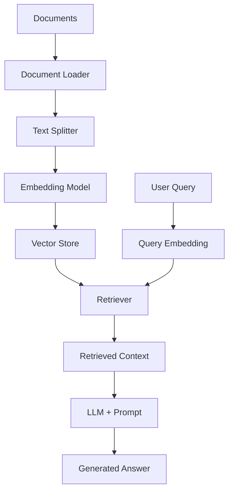

# RAG (Retrieval-Augmented Generation) Implementation Guide

## Table of Contents
1. [Overview](#overview)
2. [Architecture](#architecture)
3. [Implementation Steps](#implementation-steps)
4. [Code Examples](#code-examples)
5. [Frontend Interface](#frontend-interface)
6. [API Integration](#api-integration)
7. [Deployment](#deployment)
8. [Best Practices](#best-practices)

## Overview

RAG (Retrieval-Augmented Generation) is a powerful technique that combines document retrieval with language generation to create AI systems that can answer questions based on specific document collections. This guide covers the complete implementation pipeline from document processing to user interface.

### What RAG Does
- **Retrieves** relevant information from your documents
- **Augments** the AI's knowledge with your specific data
- **Generates** accurate responses based on retrieved context

### Key Benefits
- ✅ **Accurate**: Answers based on your actual documents
- ✅ **Up-to-date**: Uses your latest information
- ✅ **Traceable**: Can show which documents were used
- ✅ **Cost-effective**: No need to retrain models

## Architecture



### Components Breakdown

1. **Document Processing Pipeline**
   - Document Loader: Reads various file formats (PDF, TXT, DOCX)
   - Text Splitter: Breaks documents into manageable chunks
   - Embedding Model: Converts text to numerical vectors

2. **Storage & Retrieval**
   - Vector Store: Stores document embeddings for fast search
   - Retriever: Finds most relevant document chunks

3. **Generation Pipeline**
   - Query Processing: Converts user questions to embeddings
   - Context Assembly: Combines retrieved chunks with query
   - LLM Generation: Produces final answer

## Implementation Steps

### Step 1: Environment Setup

```bash
# Install required packages
pip install llama-index streamlit python-dotenv anthropic openai

# Create environment file
touch .env
```

### Step 2: Document Processing

```python
from llama_index.core import SimpleDirectoryReader, VectorStoreIndex
from llama_index.core.node_parser import SentenceSplitter

def create_index(data_path, index_name):
    """Create or load document index"""
    if not os.path.exists(index_name):
        # Load documents
        documents = SimpleDirectoryReader(
            input_dir=data_path,
            required_exts=[".pdf", ".txt", ".docx"]
        ).load_data()
        
        # Split into chunks
        parser = SentenceSplitter(chunk_size=1024, chunk_overlap=20)
        nodes = parser.get_nodes_from_documents(documents)
        
        # Create index
        index = VectorStoreIndex(nodes, show_progress=True)
        index.storage_context.persist(persist_dir=index_name)
    else:
        # Load existing index
        storage_context = StorageContext.from_defaults(persist_dir=index_name)
        index = load_index_from_storage(storage_context)
    
    return index
```

### Step 3: Query Engine Setup

```python
def setup_query_engine(index, llm_provider="openai"):
    """Setup query engine with specified LLM"""
    if llm_provider == "openai":
        from llama_index.llms.openai import OpenAI
        llm = OpenAI(model="gpt-4", temperature=0.1)
    elif llm_provider == "anthropic":
        from llama_index.llms.anthropic import Anthropic
        llm = Anthropic(model="claude-3-sonnet-20240229")
    
    return index.as_query_engine(llm=llm)
```

### Step 4: Streamlit Frontend

```python
import streamlit as st
from dotenv import load_dotenv

def main():
    st.title("🤖 RAG Document Q&A System")
    
    # Sidebar configuration
    with st.sidebar:
        st.header("Configuration")
        provider = st.selectbox("Choose LLM Provider", ["OpenAI", "Anthropic"])
        
    # Main chat interface
    if "messages" not in st.session_state:
        st.session_state.messages = []
    
    # Display chat history
    for message in st.session_state.messages:
        with st.chat_message(message["role"]):
            st.markdown(message["content"])
    
    # Chat input
    if prompt := st.chat_input("Ask a question about your documents"):
        # Add user message
        st.session_state.messages.append({"role": "user", "content": prompt})
        
        # Generate response
        with st.chat_message("assistant"):
            response = query_engine.query(prompt)
            st.markdown(str(response))
            st.session_state.messages.append({"role": "assistant", "content": str(response)})
```

## Code Examples

### Complete RAG Implementation

```python
import os
import streamlit as st
from dotenv import load_dotenv
from llama_index.core import (
    SimpleDirectoryReader, 
    VectorStoreIndex, 
    StorageContext,
    load_index_from_storage,
    Settings
)
from llama_index.llms.openai import OpenAI
from llama_index.llms.anthropic import Anthropic
from llama_index.embeddings.openai import OpenAIEmbedding

class RAGSystem:
    def __init__(self, data_path, index_name="document_index"):
        self.data_path = data_path
        self.index_name = index_name
        self.index = None
        self.query_engine = None
        
    def load_documents(self):
        """Load documents from data directory"""
        try:
            documents = SimpleDirectoryReader(
                input_dir=self.data_path,
                required_exts=[".pdf", ".txt", ".docx", ".md"]
            ).load_data()
            return documents
        except ValueError as e:
            st.error(f"No documents found in {self.data_path}")
            return []
    
    def create_or_load_index(self):
        """Create new index or load existing one"""
        if os.path.exists(self.index_name):
            # Load existing index
            storage_context = StorageContext.from_defaults(persist_dir=self.index_name)
            self.index = load_index_from_storage(storage_context)
            st.success("✅ Loaded existing document index")
        else:
            # Create new index
            documents = self.load_documents()
            if documents:
                with st.spinner("🔄 Building document index... This may take a few minutes."):
                    self.index = VectorStoreIndex.from_documents(
                        documents, 
                        show_progress=True
                    )
                    self.index.storage_context.persist(persist_dir=self.index_name)
                st.success("✅ Created new document index")
            else:
                st.error("❌ No documents to index")
                return False
        return True
    
    def setup_query_engine(self, provider="openai", model=None):
        """Setup query engine with specified provider"""
        if not self.index:
            st.error("❌ No index available")
            return False
            
        try:
            if provider.lower() == "openai":
                llm = OpenAI(
                    model=model or "gpt-4",
                    temperature=0.1,
                    api_key=os.getenv("OPENAI_API_KEY")
                )
            elif provider.lower() == "anthropic":
                llm = Anthropic(
                    model=model or "claude-3-sonnet-20240229",
                    api_key=os.getenv("ANTHROPIC_API_KEY")
                )
            else:
                st.error("❌ Unsupported provider")
                return False
                
            self.query_engine = self.index.as_query_engine(llm=llm)
            return True
        except Exception as e:
            st.error(f"❌ Error setting up query engine: {str(e)}")
            return False
    
    def query(self, question):
        """Query the RAG system"""
        if not self.query_engine:
            return "❌ Query engine not initialized"
        
        try:
            response = self.query_engine.query(question)
            return str(response)
        except Exception as e:
            return f"❌ Error processing query: {str(e)}"
```

### Environment Configuration

Create a `.env` file:

```env
# OpenAI Configuration
OPENAI_API_KEY=your_openai_api_key_here

# Anthropic Configuration  
ANTHROPIC_API_KEY=your_anthropic_api_key_here

# Optional: Custom model configurations
OPENAI_MODEL=gpt-4
ANTHROPIC_MODEL=claude-3-sonnet-20240229
```

### Streamlit App Structure

```python
def main():
    # Page configuration
    st.set_page_config(
        page_title="RAG Document Q&A",
        page_icon="🤖",
        layout="wide"
    )
    
    # Load environment variables
    load_dotenv()
    
    # Title and description
    st.title("🤖 RAG Document Q&A System")
    st.markdown("Ask questions about your documents using AI-powered search and generation.")
    
    # Sidebar configuration
    with st.sidebar:
        st.header("⚙️ Configuration")
        
        # Provider selection
        provider = st.selectbox(
            "Choose LLM Provider",
            ["OpenAI", "Anthropic"],
            help="Select which AI provider to use for generating responses"
        )
        
        # Model selection
        if provider == "OpenAI":
            model = st.selectbox("Model", ["gpt-4", "gpt-3.5-turbo"])
        else:
            model = st.selectbox("Model", ["claude-3-sonnet-20240229", "claude-3-haiku-20240307"])
        
        # Data path configuration
        data_path = st.text_input("Data Directory", value="../../data")
        
        # Initialize system button
        if st.button("🚀 Initialize RAG System"):
            initialize_rag_system(data_path, provider, model)
    
    # Main chat interface
    display_chat_interface()

def initialize_rag_system(data_path, provider, model):
    """Initialize the RAG system"""
    with st.spinner("Initializing RAG system..."):
        rag = RAGSystem(data_path)
        
        if rag.create_or_load_index():
            if rag.setup_query_engine(provider, model):
                st.session_state.rag_system = rag
                st.session_state.initialized = True
                st.success(f"✅ RAG system initialized with {provider} {model}")
            else:
                st.error("❌ Failed to setup query engine")
        else:
            st.error("❌ Failed to create/load index")

def display_chat_interface():
    """Display the chat interface"""
    if not st.session_state.get("initialized", False):
        st.info("👆 Please initialize the RAG system using the sidebar")
        return
    
    # Initialize chat history
    if "messages" not in st.session_state:
        st.session_state.messages = [
            {"role": "assistant", "content": "Hello! I'm ready to answer questions about your documents. What would you like to know?"}
        ]
    
    # Display chat history
    for message in st.session_state.messages:
        with st.chat_message(message["role"]):
            st.markdown(message["content"])
    
    # Chat input
    if prompt := st.chat_input("Ask a question about your documents..."):
        # Add user message to chat history
        st.session_state.messages.append({"role": "user", "content": prompt})
        
        # Display user message
        with st.chat_message("user"):
            st.markdown(prompt)
        
        # Generate and display assistant response
        with st.chat_message("assistant"):
            with st.spinner("Thinking..."):
                response = st.session_state.rag_system.query(prompt)
                st.markdown(response)
                st.session_state.messages.append({"role": "assistant", "content": response})

if __name__ == "__main__":
    main()
```

## API Integration

### OpenAI Integration

```python
from llama_index.llms.openai import OpenAI
from llama_index.embeddings.openai import OpenAIEmbedding

# Configure OpenAI
Settings.llm = OpenAI(
    model="gpt-4",
    temperature=0.1,
    api_key=os.getenv("OPENAI_API_KEY")
)

Settings.embed_model = OpenAIEmbedding(
    model="text-embedding-ada-002",
    api_key=os.getenv("OPENAI_API_KEY")
)
```

### Anthropic Integration

```python
from llama_index.llms.anthropic import Anthropic

# Configure Anthropic
Settings.llm = Anthropic(
    model="claude-3-sonnet-20240229",
    api_key=os.getenv("ANTHROPIC_API_KEY"),
    temperature=0.1
)
```

## Frontend Interface

### Features
- 🎯 **Multi-provider Support**: Switch between OpenAI and Anthropic
- 💬 **Chat Interface**: Natural conversation flow
- 📁 **Document Management**: Easy document loading
- ⚙️ **Configuration Panel**: Customize models and settings
- 📊 **Progress Tracking**: Visual feedback during processing
- 💾 **Session Persistence**: Maintains chat history

### Usage Instructions

1. **Setup Environment**
   ```bash
   # Clone and navigate to project
   cd rag/
   
   # Install dependencies
   pip install -r requirements.txt
   
   # Configure API keys in .env file
   ```

2. **Prepare Documents**
   ```bash
   # Add your documents to the data directory
   mkdir -p data/
   cp your_documents.pdf data/
   ```

3. **Run Application**
   ```bash
   streamlit run app.py
   ```

4. **Use Interface**
   - Select LLM provider (OpenAI/Anthropic)
   - Choose model
   - Initialize RAG system
   - Start asking questions!

## Deployment

### Local Development
```bash
# Run locally
streamlit run app.py --server.port 8501
```

### Docker Deployment
```dockerfile
FROM python:3.9-slim

WORKDIR /app
COPY requirements.txt .
RUN pip install -r requirements.txt

COPY . .
EXPOSE 8501

CMD ["streamlit", "run", "app.py", "--server.address", "0.0.0.0"]
```

### Cloud Deployment
- **Streamlit Cloud**: Direct GitHub integration
- **Heroku**: Web app deployment
- **AWS/GCP**: Container deployment

## Best Practices

### Document Preparation
- ✅ **Clean Text**: Remove unnecessary formatting
- ✅ **Consistent Structure**: Use clear headings and sections
- ✅ **Optimal Size**: 1000-2000 characters per chunk
- ✅ **Multiple Formats**: Support PDF, TXT, DOCX, MD

### Performance Optimization
- ✅ **Caching**: Store indexes for reuse
- ✅ **Chunking**: Optimal chunk size and overlap
- ✅ **Batch Processing**: Process multiple documents efficiently
- ✅ **Error Handling**: Graceful failure recovery

### Security
- ✅ **API Keys**: Use environment variables
- ✅ **Input Validation**: Sanitize user inputs
- ✅ **Rate Limiting**: Prevent API abuse
- ✅ **Access Control**: Restrict document access

### User Experience
- ✅ **Clear Feedback**: Show processing status
- ✅ **Error Messages**: Helpful error descriptions
- ✅ **Response Time**: Optimize for speed
- ✅ **Mobile Friendly**: Responsive design

## Troubleshooting

### Common Issues

1. **API Key Errors**
   ```
   Solution: Check .env file and API key validity
   ```

2. **No Documents Found**
   ```
   Solution: Verify data directory path and file extensions
   ```

3. **Index Creation Fails**
   ```
   Solution: Check document format and content
   ```

4. **Slow Responses**
   ```
   Solution: Optimize chunk size and reduce document volume
   ```

### Performance Monitoring
- Track response times
- Monitor API usage
- Log error rates
- Measure user satisfaction

## Next Steps

1. **Advanced Features**
   - Multi-modal support (images, tables)
   - Real-time document updates
   - Advanced filtering and search
   - Custom prompt templates

2. **Integration Options**
   - REST API endpoints
   - Webhook integrations
   - Database connections
   - Third-party services

3. **Scaling Considerations**
   - Vector database integration
   - Distributed processing
   - Load balancing
   - Caching strategies

---

*This guide provides a complete foundation for implementing production-ready RAG systems. Customize and extend based on your specific requirements.*